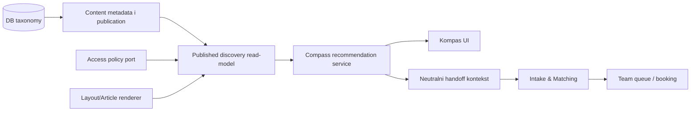

# KOMPAS TODO — discovery i recommendation sloj

**Status:** Kompas v1 vertikala radi kroz DB flow, taxonomy, Result Composer, javni drawer i admin workspace; završni sadržajni/admin E2E i postojeći Alembic drift ostaju otvoreni gate-ovi
**Datum:** 2026-08-05
**Vlasnik tehničkih odluka:** Milan Dražić (CTO)  
**Vlasnik stručne kategorizacije i javnih naziva:** Anja Stamenković i stručni tim  
**Ulazni dokument:** `CODEX HANDOFF — KOMPAS.docx`, primljen 2026-07-31  
**Povezano:** O-21 · D-047 · D-048 · D-052 · **D-053 · D-054 · D-056 · ADR-022 Amandmani 1–2** · **D-058 · D-059 · D-060 · D-061 · ADR-025** · **ADR-019 · ADR-021** · ADR-016 · ADR-018

## 0A. Kompas v1 vertikala — faze i acceptance gate-ovi (D-058)

- [x] Faza 0: D-058, ADR-025, ADR-022/024 amandmani, §8.9 i RLS plan usklađeni pre migracije.
- [x] Faza 1: Research drawer, obaveznost, validacija, `answeredCount` agregati i backend/frontend/DB integration gate-ovi prolaze.
- [x] Faza 2: atomski flow domen, migracija, lifecycle, public/staff/preview API i testovi prolaze.
- [x] Faza 3: backend Result Composer vraća stabilne sekcije, deduplikaciju i related area/topic razdvajanje.
- [x] Faza 4: `/kompas` koristi objavljeni flow, taxonomy i stvarni recommendation API bez URL selection-a; fallback zahteva eksplicitni non-production preview flag.
- [ ] Faza 5: opt-in, development-only seed je runtime provereno idempotentan. **Gate je promenjen 2026-08-04 (D-063):** traži se 2–3 stvarna urednički odobrena i objavljena **Kompas članka**, povezana sa bar dve teme i bar jednom oblašću — ne više 2–3 objavljena `service`/`program`. Usluge i programi su stranice sajta, ne glavni Kompas sadržaj; njihova relacija ostaje sledeći korak, ali ne sme biti uslov da Kompas uopšte ima sadržaj.
- [ ] Faza 6: sedam admin celina, lifecycle i isti preview Engine postoje; nedostaju autentifikovani admin browser test i potpuniji editor svih flow polja/actor evidence prikaz. **U toku (2026-08-05):** article authoring editor završen — 5-step flow (Osnovni podaci → Tekst → Oblast i teme → Kompas → Pregled i slanje), `deriveArticleCompletion` guide, inline taxonomy create, `ArticleCompassStep`, `ArticleReviewStep`. D-065 backend fix: draft termini dozvoljeni pri čuvanju. PR4 (pregled i produkcioni gate) slede. **Poboljšan overview (2026-08-05):** `ReadinessChecklist` sa animiranim `fade-up` checkovima (`loading → ok/pending/error`), per-tab učitavanje (`enabled` flag na query hookovima), `CompassAdminWorkspace` postaje prezentaciona komponenta. CMS "Povezan sadržaj" check zamenjen sa "Kompas Servisi" (✓/✗/○). 9 vitest testova. Backend `list_terms`/`list_intake_links` batch optimizacija (~10 umesto ~500+ SQL upita).
- [x] Faza 7: statički gate-ovi, backend i frontend testovi, production build, Playwright i migracioni round-trip prolaze. **D19 je zatvoren 2026-08-03** migracijom `20260803_0017` po D-060, pa je puni `alembic check` sada čist i nad čistom i nad dev bazom.

**Produkciona aktivacija (D-059):** basic Kompas je deo R3 Content obima, ali se pali nezavisno preko feature flag-a — tek kada postoje minimalni urednički podaci (Faza 5), admin prihvatni testovi (Faza 6) i zeleni javni E2E. Flag je `NEXT_PUBLIC_COMPASS_ENABLED` i **podrazumevano je isključen**: bez njega `/kompas`, `/kompas/oblasti`, `/kompas/teme` i obe kanonske rute vraćaju 404, header link i CTA na naslovnoj se ne renderuju, a sitemap ne navodi nijednu Kompas rutu. Sporedni efekat je namerno koristan — isključeno okruženje ne prerenderuje te rute, pa nedostupan backend ne može da obori njegov build.

Faza se označava završenom samo posle relevantnog gate-a. Research feedback i Kompas flow ostaju odvojeni; selection i rezultat se ne čuvaju u bazi. Otvorene stručne labele/mapiranja ostaju Anji i timu i predstavljaju podatke, ne promenu Engine ugovora.

### 0B. Evidencija implementacije po fazama

| Faza | Promenjeni fajlovi / ugovor                                                                                                                                                        | Potvrda                                                                               |
| ---- | ---------------------------------------------------------------------------------------------------------------------------------------------------------------------------------- | ------------------------------------------------------------------------------------- |
| 0    | `PRODUCT_DECISIONS.md`, ADR-022, ADR-024, novi ADR-025, CLEAN §8.9, RLS inventory i ovaj TODO                                                                                      | odluke usklađene pre migracije                                                        |
| 1    | `modules/research/{schemas,service}.py`, `seed_research_surveys.py`, `survey-drawer.tsx`, `screen-istrazivanja.tsx`, Research unit/integration/E2E testovi i generisani API tipovi | backend i browser regresije prolaze                                                   |
| 2    | novi `modules/compass/{models,schemas,service,router}.py`, API/Alembic bootstrap, migracija `20260803_0016`, flow unit/integration/contract testovi                                | upgrade/downgrade i lifecycle prolaze                                                 |
| 3    | `modules/compass/result_composer.py`, Content Compass DTO/service dopune i composer testovi                                                                                        | backend poseduje sekcije, razloge i deduplikaciju                                     |
| 4    | Compass BFF rute, `api/flow.ts`, flow model/hook/test, dinamički quiz/results, DB-backed starting view, javni Query provider i `compass.spec.ts`                                   | build i javni izbor/skip/sentinel E2E prolaze                                         |
| 5    | `scripts/seed_compass_demo.py`, seed guard testovi i `NEXT_PUBLIC_COMPASS_DEMO_PREVIEW` granica                                                                                    | dvostruki lokalni run ne duplira podatke; CMS linkage čeka eligible rows              |
| 6    | staff BFF rute, `compass-flow-api.ts`, admin hook, `compass-admin-workspace.tsx` i `screen-kompas.tsx`                                                                             | backend preview deli javni composer; browser admin gate otvoren                       |
| 6+   | `readiness-checklist.tsx` + test, per-tab `enabled` loading, `CompassAdminWorkspace` prezentaciona, backend `list_terms`/`list_intake_links` batch optimizacija                    | TSC 0 grešaka, ESLint 0, vitest 9/9, pytest 353/354                                  |
| 7    | `.github/workflows/quality.yml` uz postojeći Content Health workflow                                                                                                               | CI sada sadrži backend, frontend, build, Playwright, round-trip i D19 migration guard |

---

## 0. Kako se koristi ovaj dokument

- Ovo je jedini operativni TODO za Kompas. `TODO.md` i `CMS_TODO.md` nose samo sažetak i link ovde.
- D-053, D-054, D-056 i ADR-022 Amandmani 1–2 zaključali su taksonomiju, kanonske stranice, anonimni access i javnu dinamičku granicu. Implementacija ide backend foundation → route registry/panel → CMS → javni aggregate → recommendation → javni Kompas.
- Konačna Anjina kategorizacija menja podatke registra, ne strukturu engine-a. Novi ili precizniji nazivi ne smeju zahtevati izmenu Kompas koda.
- Ne hardkodovati stručne kategorije, sinonime ni recommendation pravila u React komponentama.
- U korisničkom i panel jeziku `topic_group` se zove **Oblast**. Sistemski `support_area` se uvek zove **Intake oblast podrške**; to nisu ista osa.
- Pitanja su opciona inline interakcija na `/kompas`, bez posebne rute i bez „korak X od Y” jezika. Preskok i sentinel „Nisam siguran/na šta mi se događa” vode na Polazni prikaz.
- Ne koristiti Intake `GuidanceFlow`/`QuestionsScreen`: njegov obavezni klinički `SafetyNotice` ne pripada Kompasu. Teme koriste novu multi-select kontrolu, najviše dve.
- Ne uvoditi AI kao preduslov za v1. Prvi engine mora biti determinističan i objašnjiv.
- `subscriber` i `purchased` postoje samo kao rezervisan ciljni ugovor. Panel ih prikazuje onemogućene kao „U pripremi” i ne sme da ih sačuva ili objavi pre stvarnog R5 entitlement sistema (D-048).
- Ne praviti Dnevnu sobu, čuvanje sadržaja ni privatne kolekcije kroz ovaj plan (O-23).
- Po važećem `TODO.md` §0A, fokusirani testovi se pokreću tokom rada, a typecheck/lint/format/architecture/test gate posle izmene. Build i E2E rade se pre završnog handoff-a kada okruženje dozvoljava.

### Statusi

| Oznaka | Značenje                                              |
| ------ | ----------------------------------------------------- |
| ✅     | Završeno                                              |
| 🟡     | Delimično                                             |
| ⬜     | Nije započeto                                         |
| 🚫     | Blokirano postojećom odlukom ili nedostajućim domenom |
| ⏸️     | Namerno kasnije                                       |

---

## 0C. Content Review Workflow — verzionisani urednički tok (plan 2026-08-05)

> **Problem:** "Pošalji na stručni pregled" prvi put uspe, ali `router.refresh()` pregazi keš pre nego što UI prikaže novo stanje. Drugi klik → 409 (`in_review` revizija nije editabilna). `deriveArticleCompletion` ne proverava `entry.status`. §5H-4 (zajednički pregled + javna kapija) je ⬜.

> **Cilj:** Neograničen broj ciklusa `draft → review → dorada → ponovni review → approved → published → nova verzija` bez dead-end stanja. Statusi štite verziju koju reviewer pregleda, ali nikad ne zaključavaju ceo entry. Svaka poslata verzija je nepromenljiv istorijski dokaz.

| #        | Obim                                       | Zavisi od | Status |
| -------- | ------------------------------------------ | --------- | ------ |
| **RW-1** | Atomsko + idempotentno slanje: `POST .../submit-review`, `idempotencyKey`, već poslata revizija vraća uspeh (ne 409) | — | ✅ | `submit_article_for_review` u `service.py`, `ContentSubmitIdempotency` tabela, migracija `20260805_0018`. 353 pytest + alembic check čisti. |
| **RW-2** | Status-aware wizard: `deriveArticleCompletion` proverava `entry.status`, dugme samo za `draft`, `in_review` prikazuje "Povuci na doradu" | RW-1 | ✅ | `lifecycle` polje, `canSubmitForReview` zahteva `draft`, `ArticleReviewStep` 4 UI stanja, `useSubmitArticleReviewMutation`, uklonjen `router.refresh()`. 431 vitest ✅. |
| **RW-3** | Nove revizije za svaki krug dorade: `POST .../new-draft`, `source_revision_id`/`superseded_at`. `published → nova verzija` ne skida staru sa sajta. | RW-2 | ✅ | `create_new_draft` servis, migracija `20260805_0019`, `ArticleReviewStep` dugmad za approved/published, `useNewContentDraftMutation`. 353 pytest + 431 vitest ✅. |
| **RW-4** | Reviewer odluke: `approved / rejected` + obavezno obrazloženje za `rejected`. Automatsko agregiranje: sva odobrenja → `approved`. Pravilo četiri oka. | RW-3 | ✅ | Four-eyes pravilo, `rejected` → auto `create_new_draft`, auto `approved`, `ArticleReviewStep` review panel sa dugmadima. 353 pytest + 431 vitest ✅. |
| **RW-5** | Urednički paket: `content_review_packages` + `items`. Jedan klik = članak + nove draft oblast/tema. Kompas Flow nije deo paketa. | RW-4 | ✅ | `_submit_package_terms` batch-fetch + tranzicija, `reason="submitted_via_article_package"`. Bez frontend izmena. 353 pytest + 431 vitest ✅. |
| **RW-6** | Review queue: `organization_review_assignments`, `GET /radni-prostor/pregledi`. Reviewer vidi samo svoj capability. | RW-5 | ✅ | `ContentReviewAssignment` model + migracija `20260806_0020`, `list_review_queue` sa four-eyes, `ReviewQueueScreen` frontend. 353 pytest + 431 vitest ✅. |
| **RW-7** | Email obaveštenja: `notification_outbox`, QStash job. Događaji: `review_requested / changes_requested / approved`. | RW-6 | ✅ | **Pun dispatcher (2026-08-06):** `ResendClient`, `dispatch_pending`, `scripts/dispatch_emails.py`, 3 HTML email template-a. Sender: `review@psihointegritet.com`. |

**Detaljan plan u `TODO.md` §5J.** Nijedan status ne primorava korisnika da obriše sadržaj.

---

## 1. Zaključana definicija proizvoda

> **Kompas je interaktivni discovery i recommendation sloj iznad zajedničkog kataloga objavljenog sadržaja.**

Kompas korisniku omogućava da:

- izabere jednu ili više oblasti/tema i odmah vidi relevantan sadržaj;
- proširi, suzi ili ukloni izbor bez obaveznog završavanja toka;
- bira između istraživanja sadržaja i prelaska ka stručnoj podršci;
- dobije objašnjiv razlog zašto je sadržaj prikazan;
- pređe u postojeći Intake bez ponavljanja neutralnog konteksta koji je već izabrao;
- iz Intake toka ode nazad na informisanje ako još nije spreman za razgovor.

### Tri odvojene javne površine

1. `/kompas/oblast/[slug]` je kanonska, indeksabilna stranica jedne šire oblasti (`topic_group`). Prikazuje odobren uvod, podteme i objavljene sadržaje vezane za tu oblast.
2. `/kompas/tema/[slug]` je kanonska, indeksabilna stranica jedne konkretne teme (`topic`) i uvek pokazuje kojoj oblasti pripada.
3. `/kompas` je dinamički istraživač koji u memoriji kombinuje više izabranih oblasti i tema. Kombinacija ne dobija novu javnu SEO stranicu ni čitljiv query URL.

Kanonska stranica objašnjava jednu oblast ili temu. Dinamički Kompas bira, uklanja duplikate i raspoređuje već odobrene sadržaje za trenutni izbor, ali ne izmišlja stručnu tvrdnju o tome kako su teme povezane. Kada tim odobri takvu tvrdnju, ona pripada opcionom `CompassGuide` entitetu.

Javni `[slug]` je zaseban, locale-aware route identitet. Ne koristi se kao recommendation ključ i ne izvodi se ponovo pri svakoj promeni javne labele. Pre prve objave tim potvrđuje predloženi slug; posle objave promena pravi novi kanonski route zapis, a prethodni ostaje redirect ka istom stabilnom terminu. Interni `stableId` ostaje nepromenljiv semantički autoritet.

Kompas nije:

- psihološki test, dijagnostika ili procena mentalnog stanja;
- krizni servis;
- novi terapeut matching algoritam;
- kopija postojećeg Intake & Matching Engine-a;
- klasičan wizard sa „korak X od Y”;
- zaseban katalog koji kopira CMS;
- page builder;
- AI personalizacija u prvoj verziji.

### Tri sistemske vrednosti puta

Kontrola mora stalno da dozvoli:

1. `explore` — želim da istražujem sadržaj;
2. `professional_support` — želim stručnu podršku;
3. `both` — sadržaj je koristan za oba puta.

„Ne znam kako da opišem” nije stručna tema i ne čuva se kao `topicId`. To je discovery ulaz/escape hatch koji korisniku nudi lakše početne izbore.

---

## 2. Stvarno trenutno stanje repozitorijuma

### 2.1 Šta već možemo ponovo koristiti

| Postojeće                                       | Stanje                                                                                           | Kako ga Kompas koristi                                                                |
| ----------------------------------------------- | ------------------------------------------------------------------------------------------------ | ------------------------------------------------------------------------------------- |
| `ContentEntry` + `ContentRevision`              | Postoje, tenant-scoped, verzionisani i auditovani                                                | Stabilan identitet i revision-bound metadata za sadržaj                               |
| `ContentReviewDecision` + publication lifecycle | Postoje                                                                                          | Stručni/poslovni review i objava sadržaja                                             |
| `ContentProvider` + CMS override                | Postoji za šest trenutnih `ContentType` vrednosti                                                | Javni read-model objavljenih entiteta                                                 |
| RichDoc + `.docx` import                        | Postoje                                                                                          | Autorski tok budućih članaka                                                          |
| Content Health                                  | Postoji                                                                                          | Publication validacija taksonomijskih referenci i metadata                            |
| `therapist_matching_profiles`                   | Postoji, tenant-scoped                                                                           | Intake autoritet za terapeute, uzrast, format, lokaciju i capability-je               |
| Intake matching v3                              | Postoji                                                                                          | Jedini autoritet za uslugu/terapeuta                                                  |
| Intake team queue + reassign                    | Postoje                                                                                          | Ljudsko preuzimanje/handoff slučaja                                                   |
| `sessionStorage` obrazac                        | Postoji za booking summary                                                                       | Kandidat za jednokratni Kompas ↔ Intake handoff                                       |
| Access decision iz ADR-018                      | Ugovor postoji, puni ResourceAsset još ne                                                        | `public/registered/staff_only` granica za v1                                          |
| K1 taxonomy registry + staff/public API         | Implementirano i pokriveno test bazom; produkcioni rollout migracije je zaseban operativni korak | DB autoritet za oblasti (`topic_group`), teme, publike, ciljeve i sistemske vrednosti |
| Public Compass aggregate + Engine               | Implementiran fail-closed public-only read-model i verzirani deterministički endpoint            | Kanonske stranice i preporuke dele istu eligibility granicu                           |
| Kanonske/list Kompas stranice                   | Implementirane četiri DB-backed rute bez kombinacionih SEO stranica                              | Objavljene oblasti/teme, sadržaji, 308 alias, sitemap i BreadcrumbList                |
| Admin „Brzi unos”                               | Implementiran nad izdvojenim shared editor slojem                                                | Šest koraka nad istim draft/payload/cache/lifecycle ugovorom                          |
| Kompas selection/session granica                | Implementirani tipizirani reducer, request adapter i kratki TTL zapisi                           | Stabilna F3/K5 osnova bez topic query parametara                                      |

### 2.2 Šta još ne postoji

| Nedostaje                                            | Posledica                                                                                                                                                        |
| ---------------------------------------------------- | ---------------------------------------------------------------------------------------------------------------------------------------------------------------- |
| `ContentType.article` i article model                | Tri kartice u `/znanje` su fallback/„u pripremi”, nisu objavljeni katalog                                                                                        |
| Article template + javna ruta + Article JSON-LD      | Kompas još nema pravi stručni članak koji može da preporuči                                                                                                      |
| Eligible objavljen CMS sadržaj za Kompas             | Flow, composer i javni prikaz rade, ali lokalna baza nema 2–3 objavljena `service`/`program` reda sa discovery metapodacima, pa se linkage ne može demonstrirati |
| Vidljiva Intake potvrda i reverse handoff            | Neutralni TTL kontekst postoji, ali oba korisnička UI toka još nisu povezana                                                                                     |
| Access oznaka, preneti početni termin, čipovi izbora | Otvoreni ostatak K6 (K6.7/K6.9/K6.11) iznad inače završenog javnog toka                                                                                          |
| Revisioned `CompassGuide`                            | Nema opcionog authored/approved vodiča za stručne tvrdnje o čestim kombinacijama                                                                                 |
| `ResourceAsset` implementacija                       | PDF/radni list još nisu preporučivi asset entiteti                                                                                                               |
| Audio/video/knjiga katalog                           | Ne uvoditi placeholder modele                                                                                                                                    |
| Pretplate/kupovine                                   | Blokirano do R5 (D-048)                                                                                                                                          |
| Dnevna soba / SavedItem                              | Zasebna O-23 odluka                                                                                                                                              |

### 2.3 Mesta na kojima stručni pojmovi danas postoje kao tekst ili zaseban rečnik

| Mesto                                                    | Uloga                    | Da li je budući autoritet                               |
| -------------------------------------------------------- | ------------------------ | ------------------------------------------------------- |
| `frontend/src/features/guidance/taxonomy.ts`             | Intake fallback registry | Ne za Kompas; kasnije generated snapshot ili DB adapter |
| `backend/.../guidance/taxonomy.py`                       | Intake stabilni ID-jevi  | Samo Intake ugovor                                      |
| `therapist_matching_profiles.areas`                      | Intake routing ID-jevi   | Operativni Intake podatak                               |
| `contracts/fixtures/taxonomy.v1.json`                    | Parity za Intake         | Ugovor O-24a, ne Kompas katalog                         |
| `frontend/src/content/therapists.ts::areas`              | Javni čipovi profila     | Ne; prezentacioni sadržaj                               |
| `frontend/src/content/homepage.ts::reasons`              | Početne javne kartice    | Ne; budući potrošač DB grupa                            |
| `frontend/src/content/homepage.ts::resources[].category` | Fallback kartice znanja  | Ne                                                      |
| `frontend/src/content/services.ts::supportAreas`         | Javni putevi/usluge      | Ne                                                      |
| `frontend/src/content/company.ts::COMPANY_TOPICS`        | B2B konfigurator         | Zaseban B2B rečnik dok ADR ne odluči mapiranje          |
| CMS therapist `areas.items` slot                         | Javni tekst profila      | Ne sme određivati recommendation logiku                 |
| Workspace demo `data.ts::areas`                          | Preview/mock prikaz      | Ne                                                      |

**Zaključak:** O-24a je rešio drift unutar Intake-a, ali nije napravio Kompas taksonomiju. Kompas mora dobiti zaseban, DB-backed katalog i eksplicitnu vezu ka Intake rečniku.

Tačan broj javnih grupa je trenutno sadržajni drift, ne arhitektonska blokada: `content-architecture.md` predlaže pet početnih puteva, homepage danas prikazuje šest kartica, a novi handoff govori o približno osam preglednih grupa. Anjina konačna tabela zamenjuje ovaj nesklad podacima registra; model i API se zbog broja grupa ne menjaju.

---

## 3. Kanonski jezik Kompasa

### 3.1 Odvojene ose

Za svaki sadržaj se odvojeno definišu:

| Osa                  | API/ugovorno ime | Primer                                    | Pravilo                                                            |
| -------------------- | ---------------- | ----------------------------------------- | ------------------------------------------------------------------ |
| Šira oblast          | `topicGroupId`   | `stress-overload`                         | UI naziv za tehničku osu `topic_group`; jedna primarna oblast u v1 |
| Konkretne teme       | `topicIds`       | `burnout`, `difficulty-resting`           | Jedna ili više tema iz izabrane oblasti                            |
| Put korisnika        | `journeyIntent`  | `explore`, `professional_support`, `both` | Tačno jedna zaključana sistemska vrednost                          |
| Cilj sadržaja        | `goalIds`        | `understand`, `practical-step`            | Jedan ili više kontrolisanih ciljeva                               |
| Publika              | `audienceIds`    | `self`, `parent`, `adolescent`            | Jedna ili više publika                                             |
| Format sadržaja      | `contentFormat`  | `article`, `worksheet`                    | Ne zvati samo `format`, jer Intake već koristi format rada         |
| Pristup              | `accessPolicy`   | `public`, `registered`                    | V1 samo vrednosti koje backend može stvarno da proveri             |
| Pretraživačke oznake | `searchTerms`    | `sagorevanje`, `iscrpljenost`             | Nikada recommendation autoritet                                    |

Ne koristiti:

- `contentType` za format — `ContentBase.type` već ima drugo javno značenje;
- `areas` kao novo API/DB ime; reč „Oblast” je dozvoljena UI labela samo za `topic_group`, dok je `support_area` uvek označen kao „Intake oblast podrške”;
- title, labelu ili slug stranice kao semantički ključ;
- slobodan string kada postoji stabilan ID.

### 3.2 Primer ugovora sadržaja

```json
{
  "topicGroupId": "stress-overload",
  "topicIds": ["burnout", "difficulty-resting"],
  "journeyIntent": "both",
  "goalIds": ["understand", "prepare-for-conversation"],
  "audienceIds": ["self"],
  "contentFormat": "article",
  "accessPolicy": "public"
}
```

Drugi sadržaj može deliti temu, ali imati drugu ulogu:

```json
{
  "topicGroupId": "stress-overload",
  "topicIds": ["burnout"],
  "journeyIntent": "explore",
  "goalIds": ["practical-step"],
  "audienceIds": ["self"],
  "contentFormat": "worksheet",
  "accessPolicy": "registered"
}
```

### 3.3 System journey ugovor i početni managed predlozi

Samo je `journeyIntent` ispod zaključan D-053/ADR-022 sistemski rečnik:

```text
journeyIntent
├── explore
├── professional_support
└── both
```

Sledeće su početni managed predlozi za unos i stručnu potvrdu, ne hardkodovan sistemski rečnik:

```text
goalIds
├── understand
├── practical-step
├── prepare-for-conversation
└── discover-support

audienceIds
├── self
├── parent
├── adolescent
├── partner
├── family
└── general-information
```

Javna labela/opis, status i redosled managed ciljeva/publika uređuju se kroz panel. Njihov stable ID ostaje nepromenljiv nakon kreiranja.

Otvoreno za Anju/tim:

- da li `child` postoji kao zasebna publika ili se uvek vodi kroz `parent` zbog pravila za maloletnike;
- da li „informišem se za drugu osobu” traži poseban ID ili pripada `general-information`.

### 3.4 Formati i pristup — cilj naspram izvršivog v1

| Vrednost            | Ciljni katalog | V1 status                                      |
| ------------------- | -------------- | ---------------------------------------------- |
| `article`           | Da             | ADR-019 usvojen; čeka K3A.3 implementaciju     |
| `program`           | Da             | Kada postoji objavljeni entitet i card adapter |
| `pdf` / `worksheet` | Da             | Posle `ResourceAsset` vertikale iz ADR-018     |
| `audio`             | Da             | ⏸️ Nema model/provider                         |
| `video`             | Da             | ⏸️ `VideoAsset` namerno nije otvoren           |

Knjiga, radionica, partner, klinika i affiliate preporuka nisu vrednosti ovog sistemskog format rečnika. Dobijaju svoj entitet/adapter ili kontrolisanu relation vrstu tek kada njihov domen bude formalno spreman.

| Access vrednost | V1                                                        | Kasnije      |
| --------------- | --------------------------------------------------------- | ------------ |
| `public`        | Da                                                        | —            |
| `registered`    | Da                                                        | —            |
| `staff_only`    | Sistemska vrednost, ne javna Kompas kartica               | —            |
| `subscriber`    | Rezervisan; prikazati disabled „U pripremi”, ne upisivati | R5, aditivno |
| `purchased`     | Rezervisan; prikazati disabled „U pripremi”, ne upisivati | R5, aditivno |

`contentFormat` treba vratiti u javnom API-ju, ali ga ne duplirati kao ručno polje kada se pouzdano izvodi iz tipa entiteta/asset-a.

---

## 4. Dve taksonomije i jedan kontrolisan most

Kompas i Intake nemaju isti posao:

| Kompas                               | Intake & Matching                                        |
| ------------------------------------ | -------------------------------------------------------- |
| Široke javne oblasti (`topic_group`) | Pet stabilnih routing `SupportAreaId` vrednosti iz D-052 |
| Konkretne sadržajne teme             | Razlozi, usluge i terapeutski capability-ji              |
| Preporučuje sadržaj                  | Preporučuje uslugu/terapeuta                             |
| Može raditi bez kompletnog izbora    | Primenjuje hard constraints                              |
| Ne rangira terapeute                 | Jedini autoritet rangiranja terapeuta                    |

Primer:

```text
Kompas topic: burnout
        │
        └── stručno odobrena veza ──> Intake support area: anxiety_stress
```

Pravila mosta:

- nova tabela/registry čuva vezu `topicId -> SupportAreaId`;
- veza može biti više-na-više;
- veza traži Clinical review;
- Kompas je koristi samo da pripremi neutralan handoff kontekst;
- nijedna veza ne dodaje matching poene i ne bira terapeuta;
- ako mapiranje nije jednoznačno, Intake postavlja svoje pitanje umesto automatskog prefill-a;
- `addiction_related_support` ostaje uža terapeutska capability oznaka, ne Kompas topic grupa;
- promena javne labele ne menja ni `topicId` ni `SupportAreaId`.

---

## 5. Preporučena granica modula



### `modules/content`

Vlasnik je:

- DB taksonomije i njenih revizija;
- revision-bound metadata sadržaja;
- objavljenog discovery read-modela;
- validacije referenci pri review/publish toku;
- determinističkog content recommendation servisa u v1;
- veza ka objavljenim uslugama/programima.

**Preporuka:** ne otvarati novi backend `modules/compass` samo zbog prve javne površine. Kompas je zaseban proizvod, ali njegov v1 domen je čitanje i preporuka objavljenog sadržaja. Novi modul traži poseban ADR i ima smisla tek ako kasnije dobije nezavisan lifecycle ili podatke koji nisu sadržaj.

### `modules/guidance`

Ostaje vlasnik:

- Intake pitanja i odgovora;
- uzrasta, lokacije i formata rada;
- service capability-ja;
- terapeuta i rangiranja;
- safety/human review pravila;
- Team Queue i handoff-a slučaja.

`modules/guidance` ne uvozi content modele niti čita Kompas tabele u matching funkciji.

### Shared ugovor

U `shared/domain` sme da postoji samo mali tip/Protocol za:

- stabilnu taksonomijsku referencu;
- `CompassHandoffContextV1`;
- kodove razloga preporuke.

DB modeli, repository i recommendation pravila ne pripadaju `shared/`.

### Layout/AI/Dnevna soba

- Layout Engine bira dozvoljeni recept/blokove za članak; ne rangira Kompas rezultate.
- Affiliate/CTA blok koristi potvrđene `relatedServiceIds`/`relatedProgramIds`, ne tagove.
- Preporuka spoljnog partnera, klinike ili affiliate ponude traži poseban stabilan entitet, disclosure i Business review; ne sme se modelovati kao slobodan URL ili sinonim teme.
- AI agenti kasnije mogu predlagati metadata, ali čovek prihvata predlog kao običnu revision izmenu.
- Dnevna soba kasnije čuva reference na objavljene sadržaje; ne ulazi u Kompas v1.

---

## 6. Kanonski DB model — usvojen ADR-022

Tačna SQLAlchemy imena mogu pratiti postojeće konvencije, ali granice ispod su zaključane.

### Stabilni identiteti

`taxonomy_terms`

- `id` — UUID;
- `organization_id` — obavezan za managed termine; `NULL` samo za system termine;
- `axis`;
- `stable_id` — nepromenljiv identitet;
- `system_defined`;
- `created_at`, `created_by_user_id`;
- unique identitet po osi i vlasniku;
- stable ID se nikada ne reciklira za drugo značenje.

Managed ose su `topic_group | topic | content_goal | audience`. System ose su `support_area | journey_intent | content_format | access_level` i postojeći lifecycle/approval ugovori. Tenant uređuje stručne termine, ali ne menja ID i semantiku system vrednosti.

### Verzije termina

`taxonomy_term_revisions`

- `term_id`;
- `version`;
- `locale`;
- `public_label`;
- `short_description`;
- `internal_expert_note`;
- `primary_parent_term_id` — samo topic → topic group;
- `journey_intent_term_id` — system izbor za put konkretne teme;
- `sort_order`;
- `icon_key` ili nullable `asset_id`;
- `public_visible`;
- `compass_enabled`;
- `status` — `draft | in_review | approved | published | archived`;
- `lock_version`;
- created/updated/published/archived actor evidence.

Labela i opis mogu da se promene bez promene stabilnog identiteta. Lifecycle, javna vidljivost i aktivnost u Kompasu su tri odvojene stvari. Arhiviranje ne briše istoriju.

### Sinonimi, pretraga i veze

`taxonomy_term_search_terms`

- vezani za tačnu term revision;
- `locale`;
- originalna i normalizovana vrednost;
- služe isključivo pretrazi i pronalaženju;
- ne ulaze direktno u recommendation score.

`taxonomy_term_relations`

- revision-bound izvor i stabilni target;
- kontrolisan `relation_kind`, počev od `related_topic`;
- nema slobodan URL, score ni therapist ID.

### Metadata sadržaja

`content_revision_taxonomy_terms`

- `revision_id`;
- `term_id`;
- kontrolisana uloga reference;
- unique po revision/term/ulozi;
- metadata pripada tačnoj reviziji, ne `ContentEntry` identitetu.

`content_revision_discovery`

- `revision_id` — 1:1;
- tačno jedan `journeyIntent`;
- izvedeni ili kontrolisano potvrđen `contentFormat`;
- eventualni kontrolisani editorial priority/tie-breaker;
- bez `estimatedTime` ako je izvodljiv;
- bez terapeuta;
- bez slobodnih tagova kao logičkog autoriteta.

`content_revision_relations`

- `revision_id`;
- `target_entry_id`;
- `relation_kind = related_service | related_program`;
- target mora biti objavljen i odgovarajućeg `ContentType`.

### Kompas ↔ Intake most

`taxonomy_intake_links`

- `topic_term_id`;
- `support_area_term_id` iz system ose sa pet D-052 ID-jeva;
- Clinical review evidence i lifecycle;
- nema score/therapist kolone.

### Tenant granica

- managed stručni termini su org-scoped;
- system ugovori su platform-wide i mogu dobiti samo odobren lokalizovan label override;
- sadržaj i njegove metadata veze ostaju tenant-scoped kroz `ContentRevision`;
- tenant ne sme redefinisati značenje system `stable_id`;
- sadržaj sme da referencira samo system termin ili managed termin iste organizacije;
- svaki public recommendation query mora krenuti iz organizacije i nikada vratiti sadržaj drugog tenant-a.

### Migracija postojećih Intake oblasti

Pet D-052 oblasti se backfill-uje kao system `support_area` termini. `therapist_matching_profiles.areas` prelazi sa JSON autoriteta na join reference kroz create → backfill → dual-read/parity → cutover faze. Matching značenje, težine i `addiction_related_support` capability se ne menjaju.

### Kanonski route identitet oblasti i teme

`stable_id` ostaje interni semantički ključ i ne mora biti javni SEO slug. Pre K2 forme koja prikazuje budući URL uvodi se mali route registry za managed `topic_group`/`topic` termine:

- term reference, tenant, locale, route kind (`oblast | tema`) i normalizovan javni `slug`;
- najviše jedan kanonski route po terminu/locale-u i unique slug po tenant/locale/route-kind granici;
- slug se potvrđuje pre prve objave i ne menja automatski sa labelom;
- korekcija već objavljenog sluga dodaje novi kanonski zapis; stari route ostaje alias i server radi permanent redirect;
- route istorija i actor evidence se ne brišu;
- slug nikada ne ulazi u recommendation, CMS metadata ili Intake most kao autoritet.

### Opcioni urednički `CompassGuide` — nije deo taxonomy termina

Česte i stručno važne kombinacije mogu kasnije dobiti poseban, odobren vodič. Vodič je sadržajni entitet u `modules/content`, ne nova taxonomy osa i ne deo K2 generičkog registry editora.

Identitet i revizija moraju biti odvojeni:

- `compass_guides`: tenant-scoped stabilan identitet i nepromenljivi `slug`/ID za administraciju; ne pravi javnu kombinacionu rutu niti sitemap stavku;
- `compass_guide_revisions`: locale, title, RichDoc summary, status, lock, actor evidence i odobrenja;
- tipizirane match reference posebno za `topic_group` i `topic` — API koristi `matchTopicGroupIds` i `matchTopicIds`, ne dvosmisleni zajednički niz;
- opcioni `audienceIds` i `goalIds` samo kao kontrolisane reference;
- ograničen skup sekcija: pregled teme, stručna veza tema, preporučeni sadržaji, praktični materijali, mediji, knjige, programi i stručna podrška;
- sekcije referenciraju objavljene entitete; nema slobodnog URL-a, therapist rangiranja ni proizvoljnog page buildera;
- najmanje Clinical + Business review pre objave; svaka stručna tvrdnja o preplitanju tema mora biti authored i odobrena.

Pravilo izbora je determinističko:

1. tačan objavljeni vodič za normalizovan skup izabranih oblasti/tema;
2. ako ga nema, jedan najkonkretniji objavljeni vodič čiji je skup podskup izbora, uz stabilan editorial/tie-break redosled;
3. preostale oblasti/teme prikazuju se odvojeno;
4. ako vodiča nema, generički prikaz samo grupiše i deduplikuje metadata rezultate bez tvrdnje da su teme stručno povezane.

`CompassGuide` ne blokira K2 ni K3 registry/CMS metadata foundation. Uvodi se tek kada postoji stvarni objavljeni katalog koji njegove sekcije mogu da referenciraju.

---

## 7. Publication i anti-drift pravila

Sadržaj ne može biti objavljen u Kompas katalog ako:

- nema tačno jednu aktivnu `topicGroupId` referencu;
- nema najmanje jednu aktivnu `topicId` referencu;
- topic nije dete izabrane oblasti;
- nema `journeyIntent`, `goalIds` ili `audienceIds`;
- referencira nepoznat ili arhiviran termin;
- `contentFormat` ne odgovara stvarnom tipu entiteta/asset-a;
- access politika nema backend evaluator;
- related service/program ne postoji ili nije objavljen;
- metadata revision nije prošla potrebni Clinical/Business review;
- pokušava da referencira terapeuta radi rangiranja.

Managed oblast/tema ne može biti objavljena bez jednog aktivnog kanonskog route zapisa za svoj tenant i locale. Javni slug koristi lowercase ASCII kebab-case; stari alias razrešava samo objavljen termin i vraća `308` ka aktuelnoj kanonskoj putanji, bez curenja draft podataka.

Za `article` je kompletan discovery metadata deo article publish gate-a. Postojeći `service`/`program` može ostati objavljen na svojoj ruti bez tog metadata, ali tada nije Kompas kandidat; uključivanje u Kompas zahteva kompletan metadata i odgovarajući review.

Promena metadata:

- menja istu `ContentRevision` dok je draft/in_review;
- posle odobrenja/objave ide kroz novu radnu verziju;
- poništava odobrenja nove revizije kao i svaka druga sadržajna izmena;
- ostaje pripisana stvarnom actor-u.

Arhivirani termin:

- nije dostupan novim draftovima;
- ne lomi istorijski objavljenu reviziju;
- stara objava i audit i dalje mogu razrešiti labelu koja je važila;
- deljeni/stari izbor korisnika dobija razumljivu zamenu ili uklanjanje, ne 500.

Jedinstveni fixture/generated artefakt:

- može da zaključava seed i API shape;
- nije runtime izvor istine posle DB migracije;
- frontend ga ne održava ručno;
- generated TypeScript tipovi dolaze iz OpenAPI ugovora.

---

## 8. Deterministički recommendation v1

### Ulaz

```json
{
  "taxonomyVersion": "kompas-taxonomy-v1",
  "ruleVersion": "compass-rules-v1",
  "locale": "sr-Latn",
  "topicGroupId": "stress-overload",
  "topicIds": ["burnout"],
  "journeyIntent": "explore",
  "goalIds": ["understand"],
  "audienceId": "self",
  "limit": 12,
  "offset": 0
}
```

Bez:

- slobodnog teksta;
- dijagnoze;
- zaključka o korisniku;
- therapist ID-ja;
- kontakta;
- matching skora.

### Eligibility pre rangiranja

Kandidat mora biti:

- objavljen;
- u traženom locale-u i tenant-u;
- sa validnim aktivnim metadata referencama;
- sa eksplicitnim efektivnim access nivoom `public`; `registered`, `staff_only` i `NULL` se odbacuju;
- podržanog formata;
- odobren za recommendation katalog.

### Početni redosled signala

1. tačan `topicId`;
2. pripadnost izabranoj `topicGroupId`;
3. `journeyIntent`;
4. `goalId`;
5. `audienceId`;
6. kontrolisani editorial tie-breaker;
7. stabilan tehnički tie-breaker radi determinističkog rezultata.

Težine i tie-break pravila pripadaju backend registry-ju sa `ruleVersion`, nikad React komponenti.

### Objašnjivost

Svaka kartica vraća najviše tri razloga, na primer:

```text
topic:burnout
goal:practical-step
audience:self
```

API vraća stabilne reason kodove i lokalizovan tekst. Ne prikazuje numerički skor.

### Empty state i proširenje

Ako nema tačnog pogotka:

1. ukloniti najpre opcioni cilj, ne temu;
2. proširiti sa konkretne teme na grupu;
3. prikazati početne/uvodne sadržaje iste grupe;
4. ponuditi pregled svih objavljenih sadržaja i nenametljiv Intake CTA.

Nikada ne prikazivati nepovezan sadržaj samo da lista ne bude prazna.

---

## 9. Minimalni backend–frontend ugovor

### Staff registry

Administrativni API podržava list/search po osi i statusu, create managed termina, novu radnu reviziju, optimistic locking, sinonime/hijerarhiju/veze, submit/review/publish/archive i actor evidence. Zaključane system vrednosti vraća kao read-only opcije za select kontrole. Nevalidna referenca vraća stabilan reason code, `fieldPath` i jasnu poruku na srpskom.

K2.0 additivno dodaje route komande samo za oblast/temu: predlog i potvrdu novog sluga, eksplicitnu korekciju sa očuvanim aliasom i read-only `canonicalPath`. Stable ID endpoint se ne menja.

Panel „Kompas” koristi ovaj API kroz regenerisan OpenAPI klijent. Ne održava taxonomy fixture kao runtime autoritet.

### Public taxonomy

`GET /api/v1/public/compass/taxonomy?locale=sr-Latn`

Vraća:

- `taxonomyVersion`;
- aktivne oblasti, labele, opise i redosled;
- podteme;
- `canonicalPath` samo za objavljene oblasti/teme, bez alias istorije;
- sinonime samo ako su potrebni klijentskoj pretrazi;
- dozvoljene journey/goal/audience vrednosti;
- ne vraća draft/arhivirane definicije.

### Recommendations

`POST /api/v1/public/compass/recommendations`

Vraća:

- `taxonomyVersion`, `ruleVersion` i locale;
- normalizovan izbor;
- objavljene kartice sa minimalnim kontrolisanim CMS identitetom: `itemKey`, `contentType`, `slug`, `template`, SEO polja i `contentFormat`; sirovi revision `slotData` nikada ne ulazi u anonimni DTO;
- literalno `public` access stanje koje je backend već procenio; nema slobodnog URL-a, a frontend rutu izvodi isključivo kroz kontrolisani system catalog;
- reason kodove i najviše tri javna, plain-language razloga po kartici;
- predložene povezane teme;
- neutralni `CompassHandoffContextV1`;
- informaciju da je izbor prilagođen ako je deljeni termin u međuvremenu arhiviran;
- stabilnu paginaciju (`offset`, `limit`, `total`, `hasMore`).

### Greške

| Slučaj                                           | Ponašanje                                                                          |
| ------------------------------------------------ | ---------------------------------------------------------------------------------- |
| Nepoznat ID u staff editoru                      | 422 sa `fieldPath`, ID-jem i jasnim uputstvom                                      |
| Arhiviran ID pri publish-u                       | Publication BLOCK finding                                                          |
| Stara javna selekcija                            | 200 + `selectionAdjustments`, bez rušenja                                          |
| Nema rezultata                                   | 200 + kontrolisani empty state                                                     |
| Backend nedostupan                               | Neutralna poruka + link ka `/znanje` i Intake-u; bez hardkodovanog lažnog kataloga |
| `staff_only` sadržaj                             | Nikada u javnom odgovoru                                                           |
| Registered ili `NULL` access anonimnom korisniku | Nikada u javnom aggregate/recommendation odgovoru; nema teaser izuzetka            |

---

## 10. Kompas ↔ Intake handoff

### `CompassHandoffContextV1`

```json
{
  "schemaVersion": "1",
  "taxonomyVersion": "kompas-taxonomy-v1",
  "topicGroupId": "stress-overload",
  "topicIds": ["burnout"],
  "audienceIds": ["self"],
  "journeyIntent": "professional_support",
  "createdAt": "ISO-8601",
  "expiresAt": "ISO-8601"
}
```

Pravila:

- kontekst je neutralan izbor interesovanja, ne dijagnoza;
- ne sadrži free text, kontakt, procenu rizika ni terapeuta;
- Intake UI prikazuje šta je preneto i traži potvrdu korisnika;
- Intake i dalje postavlja sva obavezna hard-constraint pitanja;
- prefill Intake razloga je dozvoljen samo kada odobreni most daje jednoznačan rezultat;
- backend matching računa rezultat isključivo svojim pravilima;
- reverse handoff koristi isti kontekst: „Još nisam spreman/na — želim sadržaj”.

### Stanje i privatnost

Preporuka za v1:

- izbor tokom korišćenja živi u React memoriji;
- nastavak u istom browser session-u koristi verzionisan `sessionStorage` zapis sa kratkim TTL-om;
- handoff ka Intake-u koristi jednokratni `sessionStorage` zapis, po postojećem booking-summary obrascu;
- query parametri ne nose teme — završili bi u server/proxy logovima i analytics URL-u;
- eksplicitno deljenje, ako se odobri, koristi URL fragment koji se ne šalje serveru, uz jasnu korisničku akciju;
- sirovi topic izbori se ne šalju analytics-u uz user/session identitet;
- nikakav Compass `GuidanceSession` se ne upisuje u bazu u v1 bez zasebne retention/privacy odluke.

---

## 11. Faze implementacije

### K0 — odluke i ulazni podaci

- [x] **K0.1** Pročitan `CODEX HANDOFF — KOMPAS.docx` i napravljen current-state nalaz.
- [x] **K0.2** Razdvojene Kompas topic ose od D-052 Intake routing oblasti.
- [x] **K0.3** Usvojen **D-053**: backend → panel → CMS → javni Kompas; DB autoritet; managed i system registri; bez therapist ranking-a.
- [x] **K0.4** Usvojen **ADR-022**: vlasništvo, revision model, tenant granica, API, migracija D-052 oblasti i Kompas ↔ Intake most.
- [ ] **K0.5** Potvrditi osnovni vs napredni Kompas i release mapu; „napredni” ne sme biti sinonim za AI bez konkretne vrednosti.
- [x] **K0.6** ADR-022 zaključava v1 session state: React memorija + kratki `sessionStorage` TTL, bez query topic ID-jeva, DB profila i identifikovanog analytics-a; eksplicitno deljenje ostaje otvoreno.
- [ ] **K0.7** Primiti i uneti Anjinu konačnu mapu oblasti/tema/sinonima.
- [x] **K0.8** Usvojen **D-054 / ADR-022 Amandman 1**: „Oblasti” su UI naziv za `topic_group`; kanonske oblast/tema stranice su odvojene od dinamičkog `/kompas`; stručne kombinacije pripadaju opcionom revisioned `CompassGuide` vodiču.
- [x] **K0.9** Usvojen **D-056 / ADR-022 Amandman 2**: Kompas je odvojen od Intake pitanja, anonimni endpoint je eksplicitno `public`-only, teme su nova max-2 multi-select kontrola, a `kompas` je rezervisan custom-document slug.

**Gate K0:** ✅ D-053 + D-054 + D-056 i ADR-022 Amandmani 1–2 su accepted. Nepoznate konačne labele su podaci registra i ne blokiraju implementation redosled.

### K1 — backend registry foundation

- [x] **K1.1** `taxonomy_terms`: org-scoped managed ose + globalne system ose; stable ID nema update putanju i DB identitet je zaštićen parcijalnim unique indeksima.
- [x] **K1.2** `taxonomy_term_revisions`: labela/opis, interna napomena, parent/journey reference, redosled, ikona/asset, odvojeni visibility/Compass flagovi, shared lifecycle, optimistic lock i actor evidence.
- [x] **K1.3** Revision-bound sinonimi/search terms i kontrolisane `related_topic`/`replacement` veze; sinonimi nisu recommendation autoritet.
- [x] **K1.4** Migracija `20260731_0011` seeduje pet D-052 `support_area`, tri `journey_intent`, šest `content_format` i samo izvršive D-048 access vrednosti. `subscriber`/`purchased` nisu DB redovi.
- [x] **K1.5** Ista migracija backfill-uje FK join tabelu iz JSON `areas`; Guidance čita reference kao autoritet, upozorava na parity drift i pada na legacy JSON samo kada reference još ne postoje.
- [x] **K1.6** `taxonomy_intake_links` ima tenant scope, lifecycle, lock, Clinical decision evidence i audit; nema score/therapist kolonu.
- [x] **K1.7** Draft/review/approve/publish/archive, reissue, Clinical+Business odluke, archive/replacement i RESTRICT guard-ovi implementirani su nad postojećim shared lifecycle-om. Term nema hard-delete putanju, pa se stable ID nikada ne reciklira.
- [x] **K1.8** Staff create/read/update/review/publish/archive API je pod `/api/v1/content/taxonomy`; javni read-model je `/api/v1/public/compass/taxonomy` i vraća samo published + public + Compass-enabled podatke tenant-a/locale-a.
- [x] **K1.9** Taxonomy greške vraćaju stabilan `TAX-*` code, `fieldPath` i srpsku poruku; public schema nema internal note, review ni actor podatke.
- [x] **K1.10** OpenAPI šema i `frontend/src/types/api.generated.ts` regenerisani su posle završetka backend ugovora.

**Gate K1:** ✅ Implementaciono zatvoren. Stable ID nema mutation ni hard-delete, cross-organization/reference guard-ovi su u servisu i DB-u, D-052 read ima kontrolisani dual-read cutover, a API nosi actor događaje. Napomena iz prvobitnog handoff-a o neprimenjenoj migraciji i neproverenom browser toku ostaje istorijski dokaz; važeći `TODO.md` §0A sada zahteva fokusirane i završne gate provere.

### K2 — panel „Kompas”

- [x] **K2.0a** Dodati su migracija `20260731_0012` i model route registry-ja samo za `topic_group`/`topic`: tenant + locale + route kind + lowercase ASCII kebab slug, jedan kanonski route i sačuvana alias istorija sa actor evidence-om.
- [x] **K2.0b** Staff API daje predlog/potvrdu/korekciju sluga, koristi optimistic lock i publication guard; stari alias javno vraća `308` samo ka aktuelnom objavljenom terminu. Stable ID ostaje odvojen i ne menja se.
- [x] **K2.0c** Staff/public read-model nose `canonicalPath`; route istorija ostaje samo u zaštićenom staff odgovoru, a javni taxonomy odgovor ne izlaže draft ni alias podatke. OpenAPI klijent je regenerisan.
- [x] **K2.1** Dodata je admin-only panel površina `/radni-prostor/kompas` sa tabovima **Oblasti · Teme · Publike · Ciljevi sadržaja · Povezivanja · Pregled i odobrenja**. Čita stvarni staff API kroz Clerk proxy i TanStack Query, ima loading/error/empty stanja, statusne preglede i actor evidence. „Oblasti” koriste `topic_group`; `support_area` se prikazuje samo kao „Intake oblast podrške” u Povezivanjima.
- [x] **K2.2** Napravljen je jedan generički create/edit editor sa konfiguracijom po managed osi, bez četiri kopirana formulara. Oblast, tema, publika i cilj koriste isti mutation/cache tok; tema dodatno zahteva kontrolisanu oblast i system put korisnika. Stabilni ID se unosi samo pri kreiranju i posle je zaključan. `support_area` nije dobio editor ni javni tab.
- [x] **K2.3** Generički editor sada uređuje javni naziv/opis, deduplikovane sinonime i pojmove za pretragu, topic hijerarhiju, redosled, međusobno isključivu ikonu/asset, odvojenu javnu vidljivost i Kompas aktivnost, topic-only povezane teme i internu stručnu napomenu. Sve vrednosti ulaze u isti tipizirani create/update payload; interna napomena ostaje staff-only.
- [x] **K2.4** Stable ID se pri izmeni prikazuje samo kao zaključana vrednost, bez inputa ili mutation putanje. Panel ima runtime guard za pogrešan/stari cilj editora, a sistemske vrednosti i njihova semantika ne mogu otvoriti generički editor niti se kreiraju kroz njega; vidljive su samo kao kontrolisane reference.
- [x] **K2.5** Put korisnika je stvarni DB-backed select pri uređivanju teme; format i izvršivi nivo pristupa učitavaju se iz sistemskog registra kao kontrolisane CMS opcije, dok su `subscriber`/`purchased` jasno disabled „U pripremi”. Lifecycle i approval capability su prikazani kao zaključan sistemski ugovor bez slobodnog unosa. Tab Povezivanja sada kroz stvarni `POST` tok bira konkretnu temu i read-only D-052 `support_area`; ne može kreirati ili menjati Intake oblast niti rankira terapeute.
- [x] **K2.6** Panel sada koristi stvarni staff API za `draft → in_review → approved → published → archived` i dozvoljene povratke. Managed termini traže Stručno + Poslovno odobrenje, a topic → Intake veza samo Stručno; odluka može imati napomenu i ostaje dokaz revizije. `approved/archived → draft` koristi postojeće backend pravilo nove radne revizije, a objava topic/oblasti i dalje prolazi kanonski-route guard do K2.10.
- [x] **K2.7** Prikazati mali actor badge za kreiranje, izmenu, odobrenje, objavu i arhiviranje. Badge sada prikazuje ime i ulogu (`superadmin` ili `administrator organizacije`); objava/arhiviranje čitaju stvarni lifecycle audit događaj, a Stručno/Poslovno odobrenje konkretnu review odluku revizije.
- [x] **K2.8** Implementirati razumljive srpske validation/error poruke, fokus na konkretno polje i globalni error banner bez neželjenog skrola pri običnom kliku. Kompas API sada čuva `fieldPath`/`fieldErrors`, prevodi uobičajene Pydantic poruke, a editor registra i povezivanje ka Intake-u prikazuju grešku uz odgovarajuće polje, sa fokusom `preventScroll`; samo nepoljska/nepredviđena greška ostaje globalni banner.
- [x] **K2.9** Org admin i D-051 superadmin koriste postojeće role/capability-je; ne uvoditi novu Clerk rolu niti zahtevati therapist profil superadminu. Potvrđeno: `/radni-prostor/kompas` koristi postojeći `requireOrgAdmin()` → `isWorkspaceAdmin()` (`isSuperadmin || org_admin`), navigacija koristi istu capability granicu, a backend `resolve_staff_actor()` D-051 superadminu dodaje postojeće `org_admin`/`therapist` capability-je samo za rad u tenant-u, bez membership reda ili terapeutskog profila. Audit ostaje vezan za stvarni interni user ID superadmina.
- [x] **K2.10** Pre prve objave predložiti i potvrditi javni slug, a zatim prikazati preview buduće kanonske rute `/kompas/oblast/[slug]` ili `/kompas/tema/[slug]`. Panel koristi stvarne staff proxy rute za backend predlog i potvrdu; promena labele ne menja slug. Pri korekciji postojećeg sluga panel preuzima aktuelni route lock, a backend upisuje novu kanonsku rutu i čuva staru kao redirect. K2 ne implementira javne stranice.

**K2.0 napomena:** prvobitna implementacija završena je bez primene migracije i bez stvarnog ulogovanog browser toka. To je istorijski status tog handoff-a, ne izuzetak od sadašnjeg obaveznog test ugovora iz `TODO.md` §0A.

**K2.1 granica:** ovaj korak je završio read-only upravljačku površinu nad stvarnim registrom. Create/edit je zatim dodat kroz K2.2; lifecycle komande, odobrenja i potvrda sluga i dalje se uvode redom kroz K2.3–K2.10 nad postojećim backend ugovorom.

**K2.2 granica:** ovaj korak je uveo generički create/edit osnovnog drafta kroz staff API i `lockVersion`; K2.3 ga je zatim proširio ostalim managed poljima. Lifecycle i odobrenja nisu preuranjeno dodati.

**K2.3 napomena:** asset biblioteka još ne postoji, pa editor transparentno prima ID već odobrenog asseta; ne simulira upload ni picker. Ikona i asset su jedan kontrolisani izbor i nikada se ne šalju istovremeno. Arhivirana postojeća referenca ostaje vidljiva u editoru samo da bi mogla bezbedno da se ukloni.

**K2.4 napomena:** server je već autoritet — stable ID nema update putanju, a `TAX-SYSTEM-001` odbija kreiranje sistemske ose. Panel sada istu granicu jasno prikazuje i proverava pre slanja zahteva; ne oslanja se na to da korisnik zna internu razliku između managed i system registra.

**K2.5 napomena:** format i access nisu prerano dodati na taxonomy termin — njihovi potrošači su CMS metadata forme u K3. Panel ih sada čita iz istog DB registra i jasno pokazuje izvršive naspram budućih access nivoa. Lifecycle/approval nisu posebne taxonomy ose, nego postojeći zatvoreni backend ugovor; K2.6 tek uvodi njegove akcije.

**K2.6 napomena:** četiri Next proxy rute prosleđuju samo postojeće backend `POST` ugovore za transition/review termina i Intake veze. Nema nove role, migracije ni alternativnog lifecycle-a; UI blokira „Označi kao odobreno” dok potrebna odobrenja nisu upisana, a server ostaje poslednji autoritet za lock, validaciju i objavu.

**Gate K2:** Anja ili ovlašćeni org admin može napraviti draft oblasti/teme, jasno razlikuje oblast Kompasa od Intake oblasti podrške, šalje na pregled, odobrava/objavljuje po dozvoli, menja labelu bez promene ID-ja/rute i vidi ko je izvršio svaku radnju.

### K3 — neposredna CMS integracija

- [x] **K3.1** Taxonomy reference su vezane za tačnu `ContentRevision`, ne `ContentEntry`.
- [x] **K3.2** CMS forme čitaju DB-backed kontrolisana polja za oblast, teme, put, cilj, publiku, format i nivo pristupa.
- [x] **K3.3** UI pitanja koriste jezik terapeuta: „Kojim oblastima pripada…?”, „Kome je namenjen…?”, „Šta korisnik dobija…?”, „Istraživanje, stručna podrška ili oba?”, „Ko može da pristupi?”.
- [x] **K3.4** Nema `journeyIntent`, `topicGroupId` ili `accessLevel` kao glavnih UI labela niti slobodnog taxonomy stringa.
- [x] **K3.5** Samo objavljene registry vrednosti mogu se izabrati. Pristup je trenutno ograničen na javni, jer renderer još nema entitlement handler za registrovan/pretplata/kupljeno; estimated time ostaje za resource/article ugovor.
- [x] **K3.6** Dodate su kontrolisane veze sa objavljenim CMS uslugama/programima. Server prihvata samo isti tenant, `service` ili `program` sa objavljenom revizijom; therapist, slobodan URL i affiliate target nisu deo modela.
- [x] **K3.7** Serverski Content Health daje srpski eligibility nalaz i remediation za nepotpune Kompas metapodatke.
- [x] **K3.8** Metadata izmena ulazi u postojeći actor audit (`updated_by`); izmena odobrene revizije reissue-uje draft i počinje bez odluka pregleda.
- [x] **K3.9** Sadržaj bez kompletnog metadata ostaje objavljiv na svojoj ruti, uz jasan eligibility nalaz da nije za Kompas katalog.
- [x] **K3.10** Pravne saglasnosti i `custom_document` nisu CMS `ContentRevision` metapodaci; PDF/radni list ostaju za budući odobren `ResourceAsset` ugovor.

**Gate K3:** admin uređuje stvarni podržani sadržaj, bira ID-jeve iz DB registra, čuva, dobija precizne nalaze, odobrava i objavljuje bez slobodnog taxonomy stringa.

### K3A — article/Layout i katalog sadržaja, zasebna domenska kapija

- [x] **K3A.1** ADR-019 usvojen 2026-08-03: `article` tip, identitet, `/znanje/<slug>`, javni potpis odvojen od operatera, izvori, SEO/JSON-LD, pristup, `EDIT-0xx` provera i pravilo četiri oka.
- [x] **K3A.2** ADR-021 usvojen 2026-08-03: recept je imenovan i verzionisan skup sekcija sa **fiksnim** redosledom renderovanja; autor bira koje sekcije postoje, ne kojim redom. Prvi i jedini potrošač je `article-v1`. AI generisanje nije deo ovog koraka.
- [x] **K3A.3** `ContentType.article` i `article_detail` postoje sa svih osam sekcija recepta `article-v1`, novim `articleBody` limitom (24000) i matricom odobrenja `clinical` + `business`. Telo je u postojećem `slot_data`, pa **nije trebala nijedna migracija** — `alembic check` ostaje čist. Uvedena je i nova vrsta polja `boolean` za `standalone` potvrdu, jer odsustvo odgovora ne sme da se čita kao „ne”. Parity fixture je regenerisan (9 → 10 šablona) i oba loadera prolaze nad istim fajlom.
- [x] **K3A.3a** Granica identiteta: novi `modules/content/identity.py` je jedina vrata (`require_content_identity`, `is_publicly_routable_content`, `is_article_identity`). Šest sistemskih tipova i dalje ide doslovno kroz `require_system_content_definition`, a `system_catalog.py` **nije menjan**. Članci imaju sopstvena pravila (jedan šablon, jedan locale, oblik sluga, rezervisana lista) i parity fixture `reserved-article-slugs.v1.json` sa frontend blizancem. `list_published` namerno ostaje filtriran na sistemske definicije — regresioni test čuva da članak ne uđe u taj payload, jer bi frontend parser tada vratio `null` i ceo javni sajt bi tiho pao na statički fallback.
- [🟡] **K3A.4** Završiti stvarni `.docx → RichDoc → segmenti → metadata → review → approve → publish → public article` tok. **DOCX uvoz je prerasporeden u §5H-3 (D-063, 2026-08-04); tehnički i bezbednosni obim ostaje nepromenjen.** Generički deo je isporučen 2026-08-04: `shared/parsing/upload.py` i `POST /content/rich-doc/import-docx` (preview-only) pokrivaju konverziju Word → RichDoc za bilo koje staff polje. **2026-08-04 ispravka:** proxy 404 popravljen (raw Blob + Content-Type umesto `request.formData()`), `bodyImportKey` forsira remount Tiptap editora nakon uvoza — tekst se odmah vidi. Editor ima `resize: vertical`. Ostaje segmentacija u `article_import.py` — mapiranje naslova, pitanja i vežbe u sekcije recepta. Importer ubrzava unos u interfejs koji korisniku još ne objašnjava šta unosi, pa prvo ide razumljiv ručni tok. Ručno kreiranje članka stiže kroz UX-0B, nad postojećim `POST /content/entries`.
- [ ] **K3A.5** Potvrditi koji postojeći `service`/`program` entiteti imaju discovery card adapter.
- [ ] **K3A.6** Kompas granica na **tri** mesta, ne dva: backend eligibility (`compass_service.py:222-225` → postojeći `is_publicly_routable_content`), frontend projekcija kartice (`lib/compass/taxonomy-view.ts:100-113`) i panel advisory (`features/workspace/compass-content-linking.ts:68-82`, dodato uz UX-0B). Ispravka bilo koja dva od tri znači da članak prođe proveru i tiho nestane pre prikaza.
- [ ] **K3A.7** Segment označen kao samostalno upotrebljiv ulazi u sekciju „Praktični alati” sa dubokim linkom na sidro u članku; deduplikacija mora sprečiti da se isti tekst pojavi i kao kartica i kao alat.

**Gate K3A:** najmanje jedan stvarni objavljeni članak i jedan dozvoljeni postojeći entitet ulaze u isti discovery read-model. Ova kapija ne blokira K1/K2.

**Redosled:** K3A.3 i dalje ide **posle D19**, jer uvodi novu tabelu i migraciju, a `alembic check` do tada nije čist.

### K3B — kanonske stranice i urednički vodiči

- [x] **K3B.1** Definisati read-model i bezbedan route resolver za jednu objavljenu oblast i jednu objavljenu temu; kanonske rute su `/kompas/oblast/[slug]` i `/kompas/tema/[slug]`, a stari DB alias radi validiran 308 bez open redirect-a/self-loop-a.
- [x] **K3B.2** Jedan public page aggregate automatski okuplja term, parent, objavljenu decu/related teme i samo eksplicitno `public` objavljene sadržaje iz istog organization/locale scope-a. Dodati `/kompas/oblasti` i `/kompas/teme` liste; ne pravi kopiju sadržaja ni novu stranicu za kombinaciju.
- [ ] **K3B.3** Implementirati opcioni revisioned `CompassGuide` identitet tek nad stvarnim katalogom, sa odvojenim `matchTopicGroupIds`/`matchTopicIds`, kontrolisanim sekcijama, lock-om, actor audit-om i Clinical + Business review-om.
- [ ] **K3B.4** Reference vodiča moraju pokazivati na aktivne taxonomy termine i objavljene dozvoljene sadržaje; arhivirana/neobjavljena referenca blokira approval/publish.
- [ ] **K3B.5** Ne dozvoliti slobodan page builder, slobodan URL, AI-authored stručnu vezu, therapist ID ni recommendation score u vodiču.

**Gate K3B core:** ✅ Jedna oblast i jedna tema imaju kanonski read-model, validiran alias i produkcioni discoverability ugovor. Opcioni authored `CompassGuide` ostaje namerno odložen u K3B.3–5.

### K4 — recommendation service

- [x] **K4.1** Verziran public request/response ugovor bez free text-a, kontakta, therapist ID-ja ili izbora u query parametrima; najviše dve teme.
- [x] **K4.2** Organization/locale/status/access eligibility filter; anonimno prolazi samo eksplicitno `public`, nikada `registered`, `staff_only` ili `NULL`.
- [x] **K4.3** Deterministički ranking registry sa `ruleVersion`.
- [x] **K4.4** Najviše tri plain-language razloga.
- [x] **K4.5** Kontrolisano širenje rezultata i empty state.
- [x] **K4.6** Paginacija i stabilan tie-break.
- [x] **K4.7** Nema AI poziva, embeddings-a, profila korisnika ni terapeuta.
- [ ] **K4.8** Za kombinovani prikaz birati: tačan objavljeni `CompassGuide` → najkonkretniji subset vodič → generičke odvojene sekcije; izbor vodiča ima verzirano i stabilno tie-break pravilo.
- [x] **K4.9** Generički prikaz deduplikuje sadržaje i može isticati zajedničke metadata pogotke, ali nikada ne generiše tekst o uzročnoj ili stručnoj povezanosti tema.

**Gate K4 v1:** ✅ Isti request i ista verzija kataloga daju isti redosled i razloge; `CompassGuide` grana iz K4.8 ostaje odložena dok vodič ne postoji.

### K5 — dvosmerni Intake handoff

- [x] **K5.1** `CompassHandoffContextV1` i TTL.
- [x] **K5.2** Jednokratni browser handoff bez query topic parametara.
- [ ] **K5.3** Kompas → Intake sa vidljivom potvrdom prenetog konteksta.
- [ ] **K5.4** Intake → Kompas za korisnika koji još nije spreman da zakaže.
- [ ] **K5.5** Ambiguous topic mapping ne prefill-uje razlog.
- [ ] **K5.6** Matching rezultat, usluga i terapeut ostaju isključivo Intake odgovor.

**Gate K5:** izbor `burnout` može da otvori Intake sa neutralnim kontekstom, ali promena Intake odgovora potpuno kontroliše konačnu preporuku i handoff tima ostaje dostupan.

**Status K5:** 🟡 Bezbedna storage/wire granica je završena; vidljiva potvrda u Intake-u, reverse handoff i ambiguity UI pravilo ostaju K5.3–6.

### K6 — javni Kompas UI

- [x] **K6.1** Implementirati `/kompas`, `/kompas/oblasti`, `/kompas/teme`, `/kompas/oblast/[slug]` i `/kompas/tema/[slug]`. Svih pet ruta postoji; `/kompas` je implementiran po design handoff-u nad postojećim API/state slojem.
- [x] **K6.2** Oblasti (`topic_group`) i teme dolaze iz DB read-modela; nema frontend stručnog niza. D-052 Intake oblasti se ne prikazuju kao javne Kompas oblasti. Statička taksonomija je dostupna samo van produkcije iza `NEXT_PUBLIC_COMPASS_DEMO_PREVIEW`.
- [x] **K6.3** Jedna interaktivna površina, bez „korak X od Y”.
- [x] **K6.4** Izbor oblasti odmah prikazuje sadržaj.
- [x] **K6.5** Multi-select tema/filtera, uklanjanje i reset. `maxSelections` je ugovorom ograničen na najviše dve teme; „Izmeni odgovore” i „Poništi izbor” postoje.
- [x] **K6.6** Sekcije rezultata bez beskonačnog feed-a; sekcije dolaze iz backend Result Composer-a. Konačni copy i dalje dolazi iz UX/content odluke.
- [ ] **K6.7** Razlog preporuke i access oznaka na kartici. 🟡 Razlozi se prikazuju po kartici; **access oznaka još ne postoji na kartici**. Anonimni odgovor danas nosi isključivo `public`, pa oznaka postaje vidljiva tek uz registered/staff sadržaj.
- [x] **K6.8** Stalno vidljiv nenametljiv prelaz ka stručnoj podršci.
- [ ] **K6.9** Hero i „Razlozi dolaska” otvaraju Kompas sa potvrđenim početnim ID-jem. 🟡 Hero otvara Kompas, ali **bez prenetog početnog termina** — ulaz počinje od prvog pitanja.
- [x] **K6.10** Posebna kartica za „ne znam odakle da počnem”, bez lažne stručne teme.
- [ ] **K6.11** Dinamički prikaz pokazuje čipove „Vaš trenutni izbor”, linkuje svaku oblast/temu ka njenoj kanonskoj stranici i ne koristi reč „profil”. 🟡 Kanonski linkovi postoje i reč „profil” se ne koristi; **čipovi trenutnog izbora još ne postoje**.
- [x] **K6.12** Ne kreirati `/kompas/tema/kombinacija` stranice niti čitljive topic query parametre; izbor ostaje na `/kompas` u React/session stanju.
- [ ] **K6.13** `/kompas/putanja/[opaqueId]` je kasniji privatni saved-path domen i ne ulazi u v1 bez retention/access odluke.
- [x] **K6.14** Polazni prikaz sadrži uvod, oblasti, početne/aktuelne teme, dostupne objavljene sadržaje, linkove ka listama i nenametljiv CTA ka stručnoj pomoći.
- [x] **K6.15** Kompas feedback koristi zajednički konfigurabilni survey drawer shell, zaseban `compass-experience` i session-once banner; survey state nikad ne ulazi u recommendation state. Potvrđeno na kodu (`compass-exit-feedback.tsx` + `compass-feedback-banner.tsx`) i E2E scenarijem „leaving Kompas never swallows navigation and offers isolated feedback”.

**Gate K6:** korisnik sa početne bira oblast, odmah vidi stvarno objavljen sadržaj, menja izbor, otvara kanonsku oblast/temu ili članak i može u Intake bez wizard osećaja; nijedna kombinacija ne pravi novu SEO stranicu ili stručnu tvrdnju bez odobrenog vodiča.

**Status K6:** 🟡 Sve rute i dinamički tok su implementirani nad DB flow-om, taxonomy-jem i stvarnim recommendation API-jem; javni izbor/skip/sentinel/sekcije/podrška pokriveni su E2E-om. Otvoreni su K6.7 access oznaka, K6.9 preneti početni termin i K6.11 čipovi trenutnog izbora. Puni gate ostaje otvoren i zbog Faze 5: bez 2–3 objavljena eligible sadržaja „odmah vidi stvarno objavljen sadržaj” se ne može demonstrirati.

### K6A — admin „Brzi unos”

- [x] **K6A.1** Razložiti `taxonomy-term-editor.tsx` na zajednički draft/form state, čiste payload/normalization helper-e, per-field validaciju, ponovo upotrebljive sekcije i zajednički mutation/cache tok. `guidance-flow.tsx` i `content-revision-editor.tsx` nisu preduslov ovog rada.
- [x] **K6A.2** Dodati šest koraka iznad postojećeg „Naprednog uređivanja”: tip vrednosti → identitet/draft → organizacija → početni sadržaj/povezivanje → suggest/confirm ruta → pregled/lifecycle/CMS handoff.
- [x] **K6A.3** „Sačuvaj i nastavi”/„Sačuvaj i izađi” čuvaju isti draft; stable ID se zaključava posle prvog POST-a, 409/422 ostaje field-level greška, a potvrđena ruta spaja `canonicalPath` u isti React Query cache.
- [x] **K6A.4** Brzi unos ne uvodi novi registar, lifecycle, content tip ni kopiju CMS editora. Za pun edukativni sadržaj završni CTA koristi postojeći CMS tok ili jasno navodi ADR-019/K3A preduslov.

**Gate K6A:** ✅ Admin pravi draft oblasti/teme, nastavlja kroz mapiranje i slug, može da sačuva/izađe/nastavi lifecycle, a napredni editor koristi isti state/validaciju/payload sloj.

### K7 — dodatni formati i access

- [ ] **K7.1** `ResourceAsset` vertikala za PDF/radni list po ADR-018.
- [ ] **K7.2** Knjiga/spoljna preporuka tek posle ugovora o izvoru, autoru, linku i affiliate disclosure-u.
- [ ] **K7.2a** Partner/klinika/affiliate preporuka tek posle stabilnog partner entiteta, disclosure pravila i Business review-a.
- [ ] **K7.3** Audio tek kada postoji asset/provider i playback ugovor.
- [ ] **K7.4** Video tek kada se donese provider/privacy/cost odluka.
- [ ] **K7.5** `subscriber`/`purchased` tek posle R5 entitlement podataka i access reason kodova.

### K8 — napredni Kompas i AI

- [ ] **K8.1** Najpre izmeriti osnovni Kompas: izbor → otvaranje sadržaja → prelaz u Intake.
- [ ] **K8.2** Definisati konkretnu vrednost „naprednog” tier-a.
- [ ] **K8.3** AI može predlagati topic/goal/audience metadata samo kao reviewable patch.
- [ ] **K8.4** Zod/Pydantic validacija ostaje autoritet ugovora; AI output nikad direktno u objavljenu reviziju.
- [ ] **K8.5** Bez psihološkog profilisanja i bez automatskog kliničkog zaključka.
- [ ] **K8.6** Layout/SEO/CTA agenti rade nad odobrenim blokovima i relacijama, ne menjaju Kompas granice.

---

## 12. Sutrašnji unos od Anje — format koji ne blokira razvoj

### Oblasti (`topic_group`)

| Polje              | Primer                         |
| ------------------ | ------------------------------ |
| `proposedStableId` | `stress-overload`              |
| javni naziv        | Stres i preopterećenost        |
| kratak opis        | Plain-language opis za karticu |
| redosled           | 1                              |
| javno vidljiva     | da                             |
| aktivna u Kompasu  | da                             |
| ikona/asset        | opciono                        |
| lifecycle          | draft                          |

### Teme

| Polje              | Primer                                     |
| ------------------ | ------------------------------------------ |
| `proposedStableId` | `burnout`                                  |
| `topicGroupId`     | `stress-overload`                          |
| javni naziv        | Burnout                                    |
| sinonimi           | sagorevanje; iscrpljenost; preopterećenost |
| put                | oba                                        |
| povezane teme      | opciono                                    |
| Intake veza        | `anxiety_stress`                           |
| napomena/reviewer  | stručna napomena bez javne dijagnoze       |

Pravila unosa:

- naziv se može precizirati bez promene stable ID-ja;
- ako se dve teme spoje, stari ID se arhivira i dobija eksplicitnu zamenu;
- ako se tema podeli, stari ID se ne reciklira;
- jedna tema ima jednu primarnu grupu u v1;
- cross-cutting kontekst se ne rešava dupliranjem teme;
- ne unositi „ne znam kako da opišem” kao temu;
- ništa od ovoga ne zahteva izmenu recommendation koda.

---

## 13. Stvarni acceptance tokovi

Obavezni prioritetni acceptance tokovi su:

1. Admin bira pravi članak i dodeljuje postojeće taxonomy ID-jeve.
2. Nepostojeći/arhivirani ID daje preciznu srpsku grešku i blokira objavu.
3. Clinical/Business reviewer odobrava istu revision metadata.
4. Objavljeni članak se pojavljuje u Kompasu bez frontend izmene.
5. Promena javne labele u DB menja prikaz, ali ne URL/reference/logiku.
6. Sinonim „sagorevanje” pronalazi `topicId: burnout`.
7. Izbor teme odmah menja preporuke bez wizard koraka.
8. Razlog preporuke je jasan i nema numerički skor.
9. Kompas → Intake prenosi neutralni kontekst, ali ne terapeuta.
10. Intake → Kompas vraća korisnika na sadržaj.
11. Registered i `NULL` access sadržaj ostaje van anonimnog odgovora; `staff_only` ne curi u public API.
12. Organizacija A nikada ne vidi sadržaj organizacije B.
13. Stari shared/session izbor sa arhiviranim terminom se oporavlja bez 500.
14. Sirovi topic izbor ne završava u query logu, analytics payload-u ili audit event-u.
15. `/kompas/oblast/stres-i-preopterecenost` i `/kompas/tema/burnout` ostaju kanonske pojedinačne stranice; promena labele ih ne menja, stari slug redirectuje posle eksplicitne korekcije, a izbor više termina ostaje na `/kompas` i ne proizvodi kombinacionu rutu.
16. Bez objavljenog `CompassGuide` prikaz razdvaja oblasti/teme i ne tvrdi da su stručno povezane; objavljeni exact/subset vodič dobija prednost po verziranom pravilu.

Contract/parity testovi dodaju se uz vertikalni tok i izvršavaju po važećem `TODO.md` §0A; build i E2E rade se pre završnog handoff-a kada okruženje dozvoljava.

---

## 14. Otvorene odluke koje plan ne sme da izmisli

### Od Milana

- [x] D-053/D-054/D-056 i ADR-022 Amandmani 1–2 prihvaćeni; javni v1 tok, anonimni access, feedback granica i route skup više nisu otvorene odluke.
- [x] **D-059 (2026-08-03):** basic Kompas pripada **R3 Content obimu**, ali ima **nezavisnu produkcionu aktivaciju preko feature flag-a**. Ne pravimo veštački nov proizvodni release; Kompas ostaje isključen u produkciji dok ne postoje minimalni urednički podaci, admin prihvatni testovi i zeleni javni E2E.
- [ ] Šta tačno daje „napredni Kompas”.
- [ ] Da li eksplicitno deljenje izbora ulazi u v1.
- [ ] Minimalni Layout Engine recept koji mora postojati pre prvog article renderer-a.
- [ ] Koji postojeći objavljeni service/program entiteti urednički dobijaju Kompas discovery metadata; sama tehnička kartica nije therapist/service matching odluka.

### Od Anje i stručnog tima

- [ ] Konačne oblasti, javni nazivi, opisi i redosled.
- [ ] Konkretne teme i sinonimi.
- [ ] Topic → Intake support-area veze.
- [ ] `child` i „za drugu osobu” audience odluka.
- [ ] Konkretna raspodela Anje/ovlašćenih članova na postojeće Clinical i Business review capability-je.
- [ ] Koje veze sadržaj → usluga/program su stručno i poslovno opravdane.

### Odloženo drugim domenima

- 🚫 Pretplata/kupovina — R5.
- 🚫 Company entitlement — R4 + ADR-015.
- 🚫 Saved/progress/private collections — O-23.
- ⏸️ Video provider i VideoAsset.
- ⏸️ AI personalizacija i automatsko metadata predlaganje.
- ⏸️ Krizni copy i klinički routing — zasebna pravna/stručna odluka.

---

## 15. Sledeći konkretan korak

D-058/ADR-025 su usvojeni, a Kompas v1 vertikala radi: DB flow, taxonomy, Result Composer, javni `/kompas`, admin workspace i feedback (K6.15). Redosled ispod je usvojen 2026-08-03 i zamenjuje raniji spisak — prve dve stavke sa njega (`/kompas` renderer i konfigurabilni survey drawer) su isporučene.

1. **D19 paket, samostalno i pre svega ostalog** (D-060): zasebna pregledana migracija koja namerno uklanja `intake_cases.age_group` uz obaveznu pretprovjeru nepoznatih vrednosti i neslaganja sa `subject_age_band`, bez prelaska na native enum, uz usklađivanje unique drifta oko eksplicitnih `UniqueConstraint` definicija. Gate: round-trip, test očuvanja podataka i potpuno čist `alembic check`. Otvara Fazu 7 i RLS-1.
2. **Faza 6 — admin:** dovršiti editor svih flow polja, bogatiji actor-evidence prikaz i autentifikovani browser lifecycle test.
3. **Faza 5 — novi gate (D-063, 2026-08-04):** 2–3 stvarna urednički odobrena i objavljena **Kompas članka**, povezana sa bar dve teme i bar jednom oblašću. Predloženi acceptance set: „Anksioznost nije vaš neprijatelj”, „Tugovanje nije nešto što treba preboljeti” i još jedan kraći sadržaj druge teme. ⚠️ **Zavisi od D28** — dok `required` polja nisu sprovedena za članak, ovaj gate mogu da zadovolje tri prazne stranice. Relacija ka `service`/`program` ostaje sledeći korak, ne uslov.
4. **K5.3–K5.6:** vidljiva potvrda prenetog Intake konteksta, reverse handoff Intake → Kompas i ambiguity pravilo.
5. **Ostatak K6:** access oznaka na kartici (K6.7), preneti početni termin iz hero/„Razlozi dolaska” (K6.9) i čipovi „Vaš trenutni izbor” (K6.11).
6. **Realni end-to-end acceptance tok sa admin terapeutom:** napraviti i odobriti sadržaj kroz „Brzi unos”/postojeći lifecycle, objaviti ga i potvrditi da ga javni Kompas pravilno učitava, filtrira, objašnjava i preporučuje bez frontend hardcode-a. Zavisi od 3.
7. **Produkciona aktivacija po D-059:** flag se pali tek kad su 2, 3 i 6 zeleni.
8. **Article vertikala (K3A.3–K3A.7)** po ADR-019/ADR-021, sa `anksioznost-nije-vas-neprijatelj.docx` kao ručnim acceptance scenarijem; počinje posle D19 zbog nove migracije.
9. `CompassGuide`, dodatne formate i AI širiti tek iza postojećih kapija.

---

## Status test-faze — 2026-08-01 ✅ KOMPAS OBIM ZELEN

- backend: `pytest` 302 passed / 1 skipped; Ruff, format i Pyright čisti;
- frontend: Vitest 314 passed / 1 skipped; typecheck, ESLint, architecture i menjani Prettier obim čisti;
- production build: prošao;
- Playwright E2E: 60 passed;
- Content Health gate: 0 error / 35 postojećih warning-a; CMS integration provera je preskočena jer `NEXT_PUBLIC_API_URL` nije bio podešen;
- puni frontend `format:check` i dalje prijavljuje samo ranije postojeći, neizmenjeni `scripts/smoke-cms-authenticated.mjs`; nijedan menjani fajl nema format nalaz.
