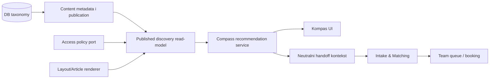

# KOMPAS TODO — discovery i recommendation sloj

**Status:** plan pre implementacije  
**Datum:** 2026-07-31  
**Vlasnik tehničkih odluka:** Milan Dražić (CTO)  
**Vlasnik stručne kategorizacije i javnih naziva:** Anja Stamenković i stručni tim  
**Ulazni dokument:** `CODEX HANDOFF — KOMPAS.docx`, primljen 2026-07-31  
**Povezano:** O-21 · O-24b · D-047 · D-048 · D-052 · ADR-016 · ADR-018 · budući ADR-019/ADR-021

---

## 0. Kako se koristi ovaj dokument

- Ovo je jedini operativni TODO za Kompas. `TODO.md` i `CMS_TODO.md` nose samo sažetak i link ovde.
- Kompas kod ne počinje dok Faza K0 ne zaključa proizvodnu odluku i ADR o taksonomiji/granicama.
- Konačna Anjina kategorizacija menja podatke registra, ne strukturu engine-a. Novi ili precizniji nazivi ne smeju zahtevati izmenu Kompas koda.
- Ne hardkodovati stručne kategorije, sinonime ni recommendation pravila u React komponentama.
- Ne praviti novi višekoračni upitnik. Kompas je interaktivna površina koja reaguje odmah.
- Ne uvoditi AI kao preduslov za v1. Prvi engine mora biti determinističan i objašnjiv.
- Ne uvoditi `subscriber`, `purchased` ili finansijske reference pre stvarnog R5 entitlement sistema (D-048).
- Ne praviti Dnevnu sobu, čuvanje sadržaja ni privatne kolekcije kroz ovaj plan (O-23).
- Po `TODO.md` §0A, testovi/build/lint/typecheck se ne pokreću automatski posle implementacije. Verifikacija se radi kao posebna faza samo na Milanov zahtev, prvenstveno kroz stvaran vertikalni korisnički tok.

### Statusi

| Oznaka | Značenje |
| --- | --- |
| ✅ | Završeno |
| 🟡 | Delimično |
| ⬜ | Nije započeto |
| 🚫 | Blokirano postojećom odlukom ili nedostajućim domenom |
| ⏸️ | Namerno kasnije |

---

## 1. Zaključana definicija proizvoda

> **Kompas je interaktivni discovery i recommendation sloj iznad zajedničkog kataloga objavljenog sadržaja.**

Kompas korisniku omogućava da:

- izabere jednu ili više tema i odmah vidi relevantan sadržaj;
- proširi, suzi ili ukloni izbor bez obaveznog završavanja toka;
- bira između istraživanja sadržaja i prelaska ka stručnoj podršci;
- dobije objašnjiv razlog zašto je sadržaj prikazan;
- pređe u postojeći Intake bez ponavljanja neutralnog konteksta koji je već izabrao;
- iz Intake toka ode nazad na informisanje ako još nije spreman za razgovor.

Kompas nije:

- psihološki test, dijagnostika ili procena mentalnog stanja;
- krizni servis;
- novi terapeut matching algoritam;
- kopija postojećeg Intake & Matching Engine-a;
- klasičan wizard sa „korak X od Y”;
- zaseban katalog koji kopira CMS;
- page builder;
- AI personalizacija u prvoj verziji.

### Tri korisničke namere

Kontrola mora stalno da dozvoli:

1. `explore` — želim da istražujem sadržaj;
2. `professional-support` — želim stručnu podršku;
3. nesiguran izbor — prikaz oba puta bez prisilnog svrstavanja.

„Ne znam kako da opišem” nije stručna tema i ne čuva se kao `topicId`. To je discovery ulaz/escape hatch koji korisniku nudi lakše početne izbore.

---

## 2. Stvarno trenutno stanje repozitorijuma

### 2.1 Šta već možemo ponovo koristiti

| Postojeće | Stanje | Kako ga Kompas koristi |
| --- | --- | --- |
| `ContentEntry` + `ContentRevision` | Postoje, tenant-scoped, verzionisani i auditovani | Stabilan identitet i revision-bound metadata za sadržaj |
| `ContentReviewDecision` + publication lifecycle | Postoje | Stručni/poslovni review i objava sadržaja |
| `ContentProvider` + CMS override | Postoji za šest trenutnih `ContentType` vrednosti | Javni read-model objavljenih entiteta |
| RichDoc + `.docx` import | Postoje | Autorski tok budućih članaka |
| Content Health | Postoji | Publication validacija taksonomijskih referenci i metadata |
| `therapist_matching_profiles` | Postoji, tenant-scoped | Intake autoritet za terapeute, uzrast, format, lokaciju i capability-je |
| Intake matching v3 | Postoji | Jedini autoritet za uslugu/terapeuta |
| Intake team queue + reassign | Postoje | Ljudsko preuzimanje/handoff slučaja |
| `sessionStorage` obrazac | Postoji za booking summary | Kandidat za jednokratni Kompas ↔ Intake handoff |
| Access decision iz ADR-018 | Ugovor postoji, puni ResourceAsset još ne | `public/registered/staff_only` granica za v1 |

### 2.2 Šta još ne postoji

| Nedostaje | Posledica |
| --- | --- |
| `ContentType.article` i article model | Tri kartice u `/znanje` su fallback/„u pripremi”, nisu objavljeni katalog |
| Article template + javna ruta + Article JSON-LD | Kompas još nema pravi stručni članak koji može da preporuči |
| Kanonske DB tabele za topic grupe/teme/sinonime | `contracts/fixtures/taxonomy.v1.json` trenutno zaključava samo Intake rečnik |
| Revision-bound discovery metadata | CMS sadržaj nema `topicIds`, `journeyIntentIds`, `goalIds`, `audienceIds` |
| Compass recommendation read-model/API | Nema autoritativnog filtriranja ni objašnjivih razloga |
| `ResourceAsset` implementacija | PDF/radni list još nisu preporučivi asset entiteti |
| Audio/video/knjiga katalog | Ne uvoditi placeholder modele |
| Pretplate/kupovine | Blokirano do R5 (D-048) |
| Dnevna soba / SavedItem | Zasebna O-23 odluka |

### 2.3 Mesta na kojima stručni pojmovi danas postoje kao tekst ili zaseban rečnik

| Mesto | Uloga | Da li je budući autoritet |
| --- | --- | --- |
| `frontend/src/features/guidance/taxonomy.ts` | Intake fallback registry | Ne za Kompas; kasnije generated snapshot ili DB adapter |
| `backend/.../guidance/taxonomy.py` | Intake stabilni ID-jevi | Samo Intake ugovor |
| `therapist_matching_profiles.areas` | Intake routing ID-jevi | Operativni Intake podatak |
| `contracts/fixtures/taxonomy.v1.json` | Parity za Intake | Ugovor O-24a, ne Kompas katalog |
| `frontend/src/content/therapists.ts::areas` | Javni čipovi profila | Ne; prezentacioni sadržaj |
| `frontend/src/content/homepage.ts::reasons` | Početne javne kartice | Ne; budući potrošač DB grupa |
| `frontend/src/content/homepage.ts::resources[].category` | Fallback kartice znanja | Ne |
| `frontend/src/content/services.ts::supportAreas` | Javni putevi/usluge | Ne |
| `frontend/src/content/company.ts::COMPANY_TOPICS` | B2B konfigurator | Zaseban B2B rečnik dok ADR ne odluči mapiranje |
| CMS therapist `areas.items` slot | Javni tekst profila | Ne sme određivati recommendation logiku |
| Workspace demo `data.ts::areas` | Preview/mock prikaz | Ne |

**Zaključak:** O-24a je rešio drift unutar Intake-a, ali nije napravio Kompas taksonomiju. Kompas mora dobiti zaseban, DB-backed katalog i eksplicitnu vezu ka Intake rečniku.

Tačan broj javnih grupa je trenutno sadržajni drift, ne arhitektonska blokada: `content-architecture.md` predlaže pet početnih puteva, homepage danas prikazuje šest kartica, a novi handoff govori o približno osam preglednih grupa. Anjina konačna tabela zamenjuje ovaj nesklad podacima registra; model i API se zbog broja grupa ne menjaju.

---

## 3. Kanonski jezik Kompasa

### 3.1 Odvojene ose

Za svaki sadržaj se odvojeno definišu:

| Osa | API/ugovorno ime | Primer | Pravilo |
| --- | --- | --- | --- |
| Šira grupa teme | `topicGroupId` | `stress-overload` | Jedna primarna javna grupa u v1 |
| Konkretne teme | `topicIds` | `burnout`, `difficulty-resting` | Jedna ili više tema iz izabrane grupe |
| Put korisnika | `journeyIntentIds` | `explore`, `professional-support` | Može sadržati oba |
| Cilj sadržaja | `goalIds` | `understand`, `practical-step` | Jedan ili više kontrolisanih ciljeva |
| Publika | `audienceIds` | `self`, `parent`, `adolescent` | Jedna ili više publika |
| Format sadržaja | `contentFormat` | `article`, `worksheet` | Ne zvati samo `format`, jer Intake već koristi format rada |
| Pristup | `accessPolicy` | `public`, `registered` | V1 samo vrednosti koje backend može stvarno da proveri |
| Pretraživačke oznake | `searchTerms` | `sagorevanje`, `iscrpljenost` | Nikada recommendation autoritet |

Ne koristiti:

- `contentType` za format — `ContentBase.type` već ima drugo javno značenje;
- `areas` kao novi generički pojam;
- title, labelu ili slug stranice kao semantički ključ;
- slobodan string kada postoji stabilan ID.

### 3.2 Primer ugovora sadržaja

```json
{
  "topicGroupId": "stress-overload",
  "topicIds": ["burnout", "difficulty-resting"],
  "journeyIntentIds": ["explore", "professional-support"],
  "goalIds": ["understand", "prepare-for-conversation"],
  "audienceIds": ["self"],
  "contentFormat": "article",
  "accessPolicy": "public"
}
```

Drugi sadržaj može deliti temu, ali imati drugu ulogu:

```json
{
  "topicGroupId": "stress-overload",
  "topicIds": ["burnout"],
  "journeyIntentIds": ["explore"],
  "goalIds": ["practical-step"],
  "audienceIds": ["self"],
  "contentFormat": "worksheet",
  "accessPolicy": "registered"
}
```

### 3.3 Predložene stabilne vrednosti koje ne zavise od Anjinih naziva grupa

Ovo su ugovorni kandidati za D-053/ADR, ne DB seed pre odobrenja:

```text
journeyIntentIds
├── explore
└── professional-support

goalIds
├── understand
├── practical-step
├── prepare-for-conversation
└── discover-support

audienceIds
├── self
├── parent
├── adolescent
├── partner
├── family
└── general-information
```

Otvoreno za Anju/tim:

- da li `child` postoji kao zasebna publika ili se uvek vodi kroz `parent` zbog pravila za maloletnike;
- da li „informišem se za drugu osobu” traži poseban ID ili pripada `general-information`.

### 3.4 Formati i pristup — cilj naspram izvršivog v1

| Vrednost | Ciljni katalog | V1 status |
| --- | --- | --- |
| `article` | Da | Posle ADR-019 i pravog article toka |
| `program` / `workshop` | Da | Može referencirati postojeće objavljene entitete |
| `pdf` / `worksheet` | Da | Posle `ResourceAsset` vertikale iz ADR-018 |
| `audio` | Da | ⏸️ Nema model/provider |
| `video` | Da | ⏸️ `VideoAsset` namerno nije otvoren |
| `book` | Da | ⏸️ Traži ugovor za kuriranu eksternu preporuku |

| Access vrednost | V1 | Kasnije |
| --- | --- | --- |
| `public` | Da | — |
| `registered` | Da | — |
| `staff_only` | Sistemska vrednost, ne javna Kompas kartica | — |
| `subscriber` | Ne upisivati | R5, aditivno |
| `purchased` | Ne upisivati | R5, aditivno |

`contentFormat` treba vratiti u javnom API-ju, ali ga ne duplirati kao ručno polje kada se pouzdano izvodi iz tipa entiteta/asset-a.

---

## 4. Dve taksonomije i jedan kontrolisan most

Kompas i Intake nemaju isti posao:

| Kompas | Intake & Matching |
| --- | --- |
| Široke javne topic grupe | Pet stabilnih routing `SupportAreaId` vrednosti iz D-052 |
| Konkretne sadržajne teme | Razlozi, usluge i terapeutski capability-ji |
| Preporučuje sadržaj | Preporučuje uslugu/terapeuta |
| Može raditi bez kompletnog izbora | Primenjuje hard constraints |
| Ne rangira terapeute | Jedini autoritet rangiranja terapeuta |

Primer:

```text
Kompas topic: burnout
        │
        └── stručno odobrena veza ──> Intake support area: anxiety_stress
```

Pravila mosta:

- nova tabela/registry čuva vezu `topicId -> SupportAreaId`;
- veza može biti više-na-više;
- veza traži Clinical review;
- Kompas je koristi samo da pripremi neutralan handoff kontekst;
- nijedna veza ne dodaje matching poene i ne bira terapeuta;
- ako mapiranje nije jednoznačno, Intake postavlja svoje pitanje umesto automatskog prefill-a;
- `addiction_related_support` ostaje uža terapeutska capability oznaka, ne Kompas topic grupa;
- promena javne labele ne menja ni `topicId` ni `SupportAreaId`.

---

## 5. Preporučena granica modula



### `modules/content`

Vlasnik je:

- DB taksonomije i njenih revizija;
- revision-bound metadata sadržaja;
- objavljenog discovery read-modela;
- validacije referenci pri review/publish toku;
- determinističkog content recommendation servisa u v1;
- veza ka objavljenim uslugama/programima.

**Preporuka:** ne otvarati novi backend `modules/compass` samo zbog prve javne površine. Kompas je zaseban proizvod, ali njegov v1 domen je čitanje i preporuka objavljenog sadržaja. Novi modul traži poseban ADR i ima smisla tek ako kasnije dobije nezavisan lifecycle ili podatke koji nisu sadržaj.

### `modules/guidance`

Ostaje vlasnik:

- Intake pitanja i odgovora;
- uzrasta, lokacije i formata rada;
- service capability-ja;
- terapeuta i rangiranja;
- safety/human review pravila;
- Team Queue i handoff-a slučaja.

`modules/guidance` ne uvozi content modele niti čita Kompas tabele u matching funkciji.

### Shared ugovor

U `shared/domain` sme da postoji samo mali tip/Protocol za:

- stabilnu taksonomijsku referencu;
- `CompassHandoffContextV1`;
- kodove razloga preporuke.

DB modeli, repository i recommendation pravila ne pripadaju `shared/`.

### Layout/AI/Dnevna soba

- Layout Engine bira dozvoljeni recept/blokove za članak; ne rangira Kompas rezultate.
- Affiliate/CTA blok koristi potvrđene `relatedServiceIds`/`relatedProgramIds`, ne tagove.
- Preporuka spoljnog partnera, klinike ili affiliate ponude traži poseban stabilan entitet, disclosure i Business review; ne sme se modelovati kao slobodan URL ili sinonim teme.
- AI agenti kasnije mogu predlagati metadata, ali čovek prihvata predlog kao običnu revision izmenu.
- Dnevna soba kasnije čuva reference na objavljene sadržaje; ne ulazi u Kompas v1.

---

## 6. Kanonski DB model — predmet ADR odluke

Preporučeni minimalni oblik:

### Stabilni identiteti

`taxonomy_terms`

- `id` — UUID;
- `axis` — `topic_group | topic | journey_intent | content_goal | audience`;
- `stable_id` — nepromenljiv identitet;
- `created_at`, `created_by_user_id`;
- unique `(axis, stable_id)`;
- stable ID se nikada ne reciklira za drugo značenje.

### Verzije termina

`taxonomy_term_revisions`

- `term_id`;
- `version_label`;
- `locale`;
- `label`;
- `description`;
- `parent_term_id` — samo topic → topic group;
- `sort_order`;
- `status` — isti lifecycle rečnik kao Content Core;
- created/updated/published/archived actor evidence.

Labela i opis mogu da se promene bez promene stabilnog identiteta. Arhiviranje ne briše istoriju.

### Sinonimi i pretraga

`taxonomy_term_search_terms`

- vezani za tačnu term revision;
- `locale`;
- originalna i normalizovana vrednost;
- služe isključivo pretrazi i pronalaženju;
- ne ulaze direktno u recommendation score.

### Metadata sadržaja

`content_revision_taxonomy_terms`

- `revision_id`;
- `term_id`;
- unique `(revision_id, term_id)`;
- metadata pripada tačnoj reviziji, ne `ContentEntry` identitetu.

`content_revision_discovery`

- `revision_id` — 1:1;
- eventualni kontrolisani editorial priority/tie-breaker;
- bez `estimatedTime` ako je izvodljiv;
- bez terapeuta;
- bez slobodnih tagova kao logičkog autoriteta.

`content_revision_relations`

- `revision_id`;
- `target_entry_id`;
- `relation_kind = related_service | related_program`;
- target mora biti objavljen i odgovarajućeg `ContentType`.

### Kompas ↔ Intake most

`taxonomy_intake_links`

- `topic_term_id`;
- `support_area_id` iz D-052;
- review evidence;
- nema score/therapist kolone.

### Tenant granica

Preporuka za ADR:

- stabilni stručni pojmovi i njihovo značenje su platform-wide;
- sadržaj i njegove metadata veze ostaju tenant-scoped kroz `ContentRevision`;
- tenant ne sme redefinisati značenje globalnog `stable_id`;
- budući tenant overlay može sakriti/omogućiti termin ili dati odobrenu lokalnu labelu, ali ne menja identitet;
- svaki public recommendation query mora krenuti iz organizacije i nikada vratiti sadržaj drugog tenant-a.

---

## 7. Publication i anti-drift pravila

Sadržaj ne može biti objavljen u Kompas katalog ako:

- nema tačno jednu aktivnu `topicGroupId` referencu;
- nema najmanje jednu aktivnu `topicId` referencu;
- topic nije dete izabrane grupe;
- nema `journeyIntentIds`, `goalIds` ili `audienceIds`;
- referencira nepoznat ili arhiviran termin;
- `contentFormat` ne odgovara stvarnom tipu entiteta/asset-a;
- access politika nema backend evaluator;
- related service/program ne postoji ili nije objavljen;
- metadata revision nije prošla potrebni Clinical/Business review;
- pokušava da referencira terapeuta radi rangiranja.

Za `article` je kompletan discovery metadata deo article publish gate-a. Postojeći `service`/`program` može ostati objavljen na svojoj ruti bez tog metadata, ali tada nije Kompas kandidat; uključivanje u Kompas zahteva kompletan metadata i odgovarajući review.

Promena metadata:

- menja istu `ContentRevision` dok je draft/in_review;
- posle odobrenja/objave ide kroz novu radnu verziju;
- poništava odobrenja nove revizije kao i svaka druga sadržajna izmena;
- ostaje pripisana stvarnom actor-u.

Arhivirani termin:

- nije dostupan novim draftovima;
- ne lomi istorijski objavljenu reviziju;
- stara objava i audit i dalje mogu razrešiti labelu koja je važila;
- deljeni/stari izbor korisnika dobija razumljivu zamenu ili uklanjanje, ne 500.

Jedinstveni fixture/generated artefakt:

- može da zaključava seed i API shape;
- nije runtime izvor istine posle DB migracije;
- frontend ga ne održava ručno;
- generated TypeScript tipovi dolaze iz OpenAPI ugovora.

---

## 8. Deterministički recommendation v1

### Ulaz

```json
{
  "taxonomyVersion": "kompas-taxonomy-v1",
  "topicGroupId": "stress-overload",
  "topicIds": ["burnout"],
  "journeyIntentIds": ["explore"],
  "goalIds": ["understand"],
  "audienceIds": ["self"],
  "limit": 12
}
```

Bez:

- slobodnog teksta;
- dijagnoze;
- zaključka o korisniku;
- therapist ID-ja;
- kontakta;
- matching skora.

### Eligibility pre rangiranja

Kandidat mora biti:

- objavljen;
- u traženom locale-u i tenant-u;
- sa validnim aktivnim metadata referencama;
- javno vidljiv ili prikaziv kao dozvoljena registered kartica;
- podržanog formata;
- odobren za recommendation katalog.

### Početni redosled signala

1. tačan `topicId`;
2. pripadnost izabranoj `topicGroupId`;
3. `journeyIntentId`;
4. `goalId`;
5. `audienceId`;
6. kontrolisani editorial tie-breaker;
7. stabilan tehnički tie-breaker radi determinističkog rezultata.

Težine i tie-break pravila pripadaju backend registry-ju sa `ruleVersion`, nikad React komponenti.

### Objašnjivost

Svaka kartica vraća najviše tri razloga, na primer:

```text
topic:burnout
goal:practical-step
audience:self
```

API vraća stabilne reason kodove i lokalizovan tekst. Ne prikazuje numerički skor.

### Empty state i proširenje

Ako nema tačnog pogotka:

1. ukloniti najpre opcioni cilj, ne temu;
2. proširiti sa konkretne teme na grupu;
3. prikazati početne/uvodne sadržaje iste grupe;
4. ponuditi pregled svih objavljenih sadržaja i nenametljiv Intake CTA.

Nikada ne prikazivati nepovezan sadržaj samo da lista ne bude prazna.

---

## 9. Minimalni backend–frontend ugovor

### Public taxonomy

`GET /api/v1/public/compass/taxonomy?locale=sr-Latn`

Vraća:

- `taxonomyVersion`;
- aktivne grupe, labele, opise i redosled;
- podteme;
- sinonime samo ako su potrebni klijentskoj pretrazi;
- dozvoljene journey/goal/audience vrednosti;
- ne vraća draft/arhivirane definicije.

### Recommendations

`POST /api/v1/public/compass/recommendations`

Vraća:

- normalizovan izbor;
- objavljene kartice sadržaja;
- `itemKind`, `contentFormat`, naslov, sažetak, route i asset preview;
- access stanje koje je backend već procenio;
- reason kodove i najviše tri javna razloga;
- computed `estimatedTime` kada postoji;
- predložene povezane teme;
- neutralni `CompassHandoffContextV1`;
- informaciju da je izbor prilagođen ako je deljeni termin u međuvremenu arhiviran.

### Greške

| Slučaj | Ponašanje |
| --- | --- |
| Nepoznat ID u staff editoru | 422 sa `fieldPath`, ID-jem i jasnim uputstvom |
| Arhiviran ID pri publish-u | Publication BLOCK finding |
| Stara javna selekcija | 200 + `selectionAdjustments`, bez rušenja |
| Nema rezultata | 200 + kontrolisani empty state |
| Backend nedostupan | Neutralna poruka + link ka `/znanje` i Intake-u; bez hardkodovanog lažnog kataloga |
| `staff_only` sadržaj | Nikada u javnom odgovoru |
| Registered sadržaj anonimnom korisniku | Kartica samo ako politika dozvoli teaser; sadržaj ostaje zaključan backendom |

---

## 10. Kompas ↔ Intake handoff

### `CompassHandoffContextV1`

```json
{
  "schemaVersion": "1",
  "taxonomyVersion": "kompas-taxonomy-v1",
  "topicGroupId": "stress-overload",
  "topicIds": ["burnout"],
  "audienceIds": ["self"],
  "journeyIntentIds": ["professional-support"],
  "createdAt": "ISO-8601",
  "expiresAt": "ISO-8601"
}
```

Pravila:

- kontekst je neutralan izbor interesovanja, ne dijagnoza;
- ne sadrži free text, kontakt, procenu rizika ni terapeuta;
- Intake UI prikazuje šta je preneto i traži potvrdu korisnika;
- Intake i dalje postavlja sva obavezna hard-constraint pitanja;
- prefill Intake razloga je dozvoljen samo kada odobreni most daje jednoznačan rezultat;
- backend matching računa rezultat isključivo svojim pravilima;
- reverse handoff koristi isti kontekst: „Još nisam spreman/na — želim sadržaj”.

### Stanje i privatnost

Preporuka za v1:

- izbor tokom korišćenja živi u React memoriji;
- nastavak u istom browser session-u koristi verzionisan `sessionStorage` zapis sa kratkim TTL-om;
- handoff ka Intake-u koristi jednokratni `sessionStorage` zapis, po postojećem booking-summary obrascu;
- query parametri ne nose teme — završili bi u server/proxy logovima i analytics URL-u;
- eksplicitno deljenje, ako se odobri, koristi URL fragment koji se ne šalje serveru, uz jasnu korisničku akciju;
- sirovi topic izbori se ne šalju analytics-u uz user/session identitet;
- nikakav Compass `GuidanceSession` se ne upisuje u bazu u v1 bez zasebne retention/privacy odluke.

---

## 11. Faze implementacije

### K0 — odluke i ulazni podaci

- [x] **K0.1** Pročitan `CODEX HANDOFF — KOMPAS.docx` i napravljen current-state nalaz.
- [x] **K0.2** Razdvojene Kompas topic ose od D-052 Intake routing oblasti.
- [ ] **K0.3** Upisati Product Decision **D-053**: definicija Kompasa, osi v1, DB autoritet, deterministički v1, bez therapist ranking-a.
- [ ] **K0.4** Napisati **ADR-022**: vlasništvo taksonomije, revision model, tenant granica, API i Kompas ↔ Intake most.
- [ ] **K0.5** Potvrditi osnovni vs napredni Kompas i release mapu; „napredni” ne sme biti sinonim za AI bez konkretne vrednosti.
- [ ] **K0.6** Potvrditi privacy odluku za session/share state.
- [ ] **K0.7** Primiti i uneti Anjinu konačnu mapu grupa/tema/sinonima.

**Gate K0:** D-053 + ADR-022 accepted. Tačne Anjine labele mogu stići posle ADR-a jer su podaci, ali pre javnog UI-ja.

### K1 — article i katalog preduslovi

- [ ] **K1.1** ADR-019: `article` tip, identitet, autor/reviewer, izvori, SEO/JSON-LD i javna ruta.
- [ ] **K1.2** Zaključati minimalni Layout Engine recept za članak pre prvog blog renderer-a (ADR-021); bez AI generisanja layouta u ovom koraku.
- [ ] **K1.3** Dodati `ContentType.article`/article template tek posle ADR-019.
- [ ] **K1.4** Završiti jedan stvarni `.docx → RichDoc → review → approve → publish → public article` vertikalni tok.
- [ ] **K1.5** Odlučiti koji postojeći `service`/`program` entiteti smeju u discovery katalog i sa kojim card adapterom.

**Gate K1:** najmanje jedan pravi objavljen članak i jedan objavljen postojeći entitet mogu da se čitaju iz istog discovery read-modela.

### K2 — DB taxonomy foundation

- [ ] **K2.1** Implementirati stabilne term identitete i versioned labele/opise.
- [ ] **K2.2** Implementirati topic group → topic hijerarhiju.
- [ ] **K2.3** Implementirati sinonime/search terms bez recommendation autoriteta.
- [ ] **K2.4** Implementirati migration/seed import iz Anjine potvrđene tabele.
- [ ] **K2.5** Implementirati lifecycle, actor badge/audit i archive pravila.
- [ ] **K2.6** Implementirati public taxonomy read-model.
- [ ] **K2.7** Uvesti `topicId -> SupportAreaId` most bez menjanja Intake scoring-a.
- [ ] **K2.8** Nakon DB vertikale ukloniti ručno održavanje Kompas registra na frontendu; OpenAPI/generated tipovi postaju ugovor.

**Gate K2:** promena javne labele u DB ne menja ID, ne traži izmenu React/Python koda i ne lomi postojeću referencu.

### K3 — CMS discovery metadata

- [ ] **K3.1** Vezati taxonomy reference za `ContentRevision`, ne `ContentEntry`.
- [ ] **K3.2** Dodati schema-driven polja za grupu, teme, journey, cilj i publiku.
- [ ] **K3.3** Format i estimated time izvoditi kada god je moguće.
- [ ] **K3.4** Dodati potvrđene veze ka uslugama/programima.
- [ ] **K3.5** Isključiti therapist recommendation metadata.
- [ ] **K3.6** Dodati server Content Health pravila i jasne srpske remediation poruke.
- [ ] **K3.7** Metadata izmena mora da se vidi u `createdBy/updatedBy` i da poništi odobrenja nove revizije.
- [ ] **K3.8** Content bez kompletnog metadata može ostati objavljen na svojoj ruti, ali ne ulazi u Kompas katalog dok ne prođe Compass eligibility gate.

**Gate K3:** admin uređuje stvarni članak, bira ID-jeve iz DB registra, čuva, dobija precizne nalaze, odobrava i objavljuje bez slobodnog taxonomy stringa.

### K4 — recommendation service

- [ ] **K4.1** Verziran request/response ugovor.
- [ ] **K4.2** Tenant/locale/status/access eligibility filter.
- [ ] **K4.3** Deterministički ranking registry sa `ruleVersion`.
- [ ] **K4.4** Najviše tri plain-language razloga.
- [ ] **K4.5** Kontrolisano širenje rezultata i empty state.
- [ ] **K4.6** Paginacija i stabilan tie-break.
- [ ] **K4.7** Nema AI poziva, embeddings-a, profila korisnika ni terapeuta.

**Gate K4:** isti request i ista verzija kataloga daju isti redosled i razloge.

### K5 — dvosmerni Intake handoff

- [ ] **K5.1** `CompassHandoffContextV1` i TTL.
- [ ] **K5.2** Jednokratni browser handoff bez query topic parametara.
- [ ] **K5.3** Kompas → Intake sa vidljivom potvrdom prenetog konteksta.
- [ ] **K5.4** Intake → Kompas za korisnika koji još nije spreman da zakaže.
- [ ] **K5.5** Ambiguous topic mapping ne prefill-uje razlog.
- [ ] **K5.6** Matching rezultat, usluga i terapeut ostaju isključivo Intake odgovor.

**Gate K5:** izbor `burnout` može da otvori Intake sa neutralnim kontekstom, ali promena Intake odgovora potpuno kontroliše konačnu preporuku i handoff tima ostaje dostupan.

### K6 — javni Kompas UI

- [ ] **K6.1** Ruta i javna metadata tek kada K2–K5 API radi.
- [ ] **K6.2** Grupe dolaze iz DB read-modela; nema frontend stručnog niza.
- [ ] **K6.3** Jedna interaktivna površina, bez „korak X od Y”.
- [ ] **K6.4** Izbor grupe odmah prikazuje sadržaj.
- [ ] **K6.5** Multi-select tema/filtera, uklanjanje i reset.
- [ ] **K6.6** Sekcije rezultata bez beskonačnog feed-a; konačni copy dolazi iz UX/content odluke.
- [ ] **K6.7** Razlog preporuke i access oznaka na kartici.
- [ ] **K6.8** Stalno vidljiv nenametljiv prelaz ka stručnoj podršci.
- [ ] **K6.9** Hero i „Razlozi dolaska” otvaraju Kompas sa potvrđenim početnim ID-jem.
- [ ] **K6.10** Posebna kartica za „ne znam odakle da počnem”, bez lažne stručne teme.

**Gate K6:** korisnik sa početne bira grupu, odmah vidi stvarno objavljen sadržaj, menja izbor, otvara članak i može u Intake bez wizard osećaja.

### K7 — dodatni formati i access

- [ ] **K7.1** `ResourceAsset` vertikala za PDF/radni list po ADR-018.
- [ ] **K7.2** Knjiga/spoljna preporuka tek posle ugovora o izvoru, autoru, linku i affiliate disclosure-u.
- [ ] **K7.2a** Partner/klinika/affiliate preporuka tek posle stabilnog partner entiteta, disclosure pravila i Business review-a.
- [ ] **K7.3** Audio tek kada postoji asset/provider i playback ugovor.
- [ ] **K7.4** Video tek kada se donese provider/privacy/cost odluka.
- [ ] **K7.5** `subscriber`/`purchased` tek posle R5 entitlement podataka i access reason kodova.

### K8 — napredni Kompas i AI

- [ ] **K8.1** Najpre izmeriti osnovni Kompas: izbor → otvaranje sadržaja → prelaz u Intake.
- [ ] **K8.2** Definisati konkretnu vrednost „naprednog” tier-a.
- [ ] **K8.3** AI može predlagati topic/goal/audience metadata samo kao reviewable patch.
- [ ] **K8.4** Zod/Pydantic validacija ostaje autoritet ugovora; AI output nikad direktno u objavljenu reviziju.
- [ ] **K8.5** Bez psihološkog profilisanja i bez automatskog kliničkog zaključka.
- [ ] **K8.6** Layout/SEO/CTA agenti rade nad odobrenim blokovima i relacijama, ne menjaju Kompas granice.

---

## 12. Sutrašnji unos od Anje — format koji ne blokira razvoj

### Grupe

| Polje | Primer |
| --- | --- |
| `proposedStableId` | `stress-overload` |
| javni naziv | Stres i preopterećenost |
| kratak opis | Plain-language opis za karticu |
| redosled | 1 |
| aktivna | da |

### Teme

| Polje | Primer |
| --- | --- |
| `proposedStableId` | `burnout` |
| `topicGroupId` | `stress-overload` |
| javni naziv | Burnout |
| sinonimi | sagorevanje; iscrpljenost; preopterećenost |
| Intake veza | `anxiety_stress` |
| napomena/reviewer | stručna napomena bez javne dijagnoze |

Pravila unosa:

- naziv se može precizirati bez promene stable ID-ja;
- ako se dve teme spoje, stari ID se arhivira i dobija eksplicitnu zamenu;
- ako se tema podeli, stari ID se ne reciklira;
- jedna tema ima jednu primarnu grupu u v1;
- cross-cutting kontekst se ne rešava dupliranjem teme;
- ne unositi „ne znam kako da opišem” kao temu;
- ništa od ovoga ne zahteva izmenu recommendation koda.

---

## 13. Stvarni acceptance tokovi

Kada Milan otvori posebnu fazu testiranja, prioritet su:

1. Admin bira pravi članak i dodeljuje postojeće taxonomy ID-jeve.
2. Nepostojeći/arhivirani ID daje preciznu srpsku grešku i blokira objavu.
3. Clinical/Business reviewer odobrava istu revision metadata.
4. Objavljeni članak se pojavljuje u Kompasu bez frontend izmene.
5. Promena javne labele u DB menja prikaz, ali ne URL/reference/logiku.
6. Sinonim „sagorevanje” pronalazi `topicId: burnout`.
7. Izbor teme odmah menja preporuke bez wizard koraka.
8. Razlog preporuke je jasan i nema numerički skor.
9. Kompas → Intake prenosi neutralni kontekst, ali ne terapeuta.
10. Intake → Kompas vraća korisnika na sadržaj.
11. Registered sadržaj ostaje backend-zaštićen; `staff_only` ne curi u public API.
12. Tenant A nikada ne vidi sadržaj tenant-a B.
13. Stari shared/session izbor sa arhiviranim terminom se oporavlja bez 500.
14. Sirovi topic izbor ne završava u query logu, analytics payload-u ili audit event-u.

Mali broj contract/parity testova može se dodati uz vertikalni tok, ali se izvršava samo u posebno zatraženoj test-fazi po `TODO.md` §0A.

---

## 14. Otvorene odluke koje plan ne sme da izmisli

### Od Milana

- [ ] D-053 i ADR-022 prihvatanje.
- [ ] Da li je basic Kompas deo R3 Content release-a ili zaseban release iza feature flag-a.
- [ ] Šta tačno daje „napredni Kompas”.
- [ ] Da li eksplicitno deljenje izbora ulazi u v1.
- [ ] Minimalni Layout Engine recept koji mora postojati pre prvog article renderer-a.
- [ ] Da li Kompas v1 preporučuje postojeće usluge/programe ili samo sadržaj uz zaseban Intake CTA.

### Od Anje i stručnog tima

- [ ] Konačne grupe, javni nazivi, opisi i redosled.
- [ ] Konkretne teme i sinonimi.
- [ ] Topic → Intake support-area veze.
- [ ] `child` i „za drugu osobu” audience odluka.
- [ ] Ko odobrava izmene taksonomije.
- [ ] Koje veze sadržaj → usluga/program su stručno i poslovno opravdane.

### Odloženo drugim domenima

- 🚫 Pretplata/kupovina — R5.
- 🚫 Company entitlement — R4 + ADR-015.
- 🚫 Saved/progress/private collections — O-23.
- ⏸️ Video provider i VideoAsset.
- ⏸️ AI personalizacija i automatsko metadata predlaganje.
- ⏸️ Krizni copy i klinički routing — zasebna pravna/stručna odluka.

---

## 15. Sledeći konkretan korak

Posle usvajanja ovog plana:

1. zapisati D-053 bez konačnih Anjinih labela;
2. napisati ADR-022 sa DB modelom, tenant granicom, API-jem i privacy state odlukom;
3. sutrašnju Anjinu tabelu uneti kao seed/import podatke;
4. zatim sprovesti K1 → K2 → K3 → K4 → K5 → K6;
5. tek posle stvarnog osnovnog toka širiti formate i AI.
